# Sequence diagrams (Phase 1, item 2)

**Status: DRAFT for G1. Version 2 (reframe, LEDGER ladder step 1), fix block 1.** v1 and its verifier reports (`docs/verification/P1-sequences-lensR.md`, `-lensR-2.md`) are superseded. Their line numbers don't apply to this version. Fix block 1 (applied before any v2 verifier report) makes every "CONTRACT silent" mark cite a LEDGER item or an open question: the ten gaps that had no item now cite **CF-26 to CF-35**, which this fix block adds to LEDGER. It also re-ran the Mermaid lint. Those items route the gaps to CONTRACT. No diagram draws the missing behaviour, so this document is **not ahead of** CONTRACT and **matches** the pinned siblings below.

**Pinned siblings** (fix-block identity from LEDGER; short SHA-256 taken when v2 was written, re-checked unchanged at fix block 1):

| Sibling | Version | SHA-256 |
|---|---|---|
| `docs/CONTRACT.md` | v3, fix block H | `d2f72422…a3e1d781` |
| `docs/THREAT_MODEL.md` | v2, fix block 8 | `6799bd75…bdb4c982` |
| `docs/adr/ADR-001-custody-signing.md` | fix block 10 | `ce0106ea…dedb124a` |
| `docs/adr/ADR-008-independent-monitor.md` | fix block 6 | `f81850e2…d0e565ea` |
| `docs/constants.md` | Phase 0, sources accessed 2026-10-02 | `e494e772…a58ebed3` |

**Framing rule.** These diagrams are a **view** of CONTRACT v3 fix block H, not a second specification.
- Every message or note that carries a money, compliance or failure decision is labelled with the CONTRACT section and state or row it implements, in square brackets, for example `[§5.4 SIGNED]`.
- A diagram never states behaviour that CONTRACT doesn't. The monitor and signer steps come from THREAT_MODEL B9/§D, ADR-001 and ADR-008, and are labelled with those sources.
- Where CONTRACT is silent, the diagram says **"CONTRACT silent"** and cites the open question (`Q-…`) or LEDGER item (`CF-…`), instead of inventing behaviour.
- Where a diagram omits §5 rows, the line under it lists them.
- Arc facts cite `docs/constants.md` (`C-…`, `M-…`).

## Conventions
- **Amounts.** Amounts are integers in CONTRACT notation: `k = 10^(18−p)`, `m = ⌊W/k⌋`, dust `W mod k`, on-chain payout value `A×k` wei, and `h` = the item's current `heldAmount` (§5.1). Fees are `gasUsed×effectiveGasPrice` wei (C-25).
- **No real data.** Wallets are named by role `r` (`hot`, `gas`, `collection`) and parties by symbol (`destination`, `accountRef`). No address, key or personal data appears.
- **`alt` blocks.** Steps after an `alt` continue from its **first** branch, unless they say they apply to every outcome. Every other branch ends where its text says.
- **Every keyed CBS call** can return AMBIGUOUS, and F1 then applies; F1 is not redrawn in each diagram. Results that aren't drawn follow §1.5: UNRESOLVED and CONFLICT → PAUSE, and a Fact-class REJECTED → PAUSE.
- **"PAUSE (P0)"** means the PAUSE path drawn in P0: the adapter stops at once, reports to the monitor, and the monitor sends `PAUSE` to the signer.
- **`PayoutOutcome`** is emitted on every arrival at RELEASED, SETTLED, HELD_FOR_CASE, QUARANTINED or PAUSED (§4, §5.4). It is drawn only where it helps.
- **CBS → adapter events** enter the adapter's inbox and are acked after commit (§4). The §1.7 in-flight gate applies to all of them (F5).
- **Reads (THREAT_MODEL L-3).** Address-specific reads go **only to own nodes**: balances, `eth_call`, nonces, address-filtered logs and receipts for our hashes. The reference RPC gets only unfiltered range queries, block hashes and already-signed transactions. With a single own node these reads are single-source, and DR-10 is the cross-check.
- **Syntax check.** Mermaid syntax was checked by a structural lint only: every `alt`, `opt` and `loop` closed by `end`, every `else` inside an `alt`, every arrow and `Note over` naming a declared participant, and no `;`, `#` or `%%` in message, note or block-label text (Mermaid ends text at those characters). Fix block 1 re-ran it and found nothing to change. No renderer ran (inspection-only).

## Participants

| Id | Who | Source |
|---|---|---|
| `CBS` | Core banking system: system of record, approvals, cases, holds | CONTRACT §3–§4 |
| `SCR` | Screening, reached through the CBS `screen` operation, with its `ScreeningOutcome` events | §3, §4 |
| `AD` | Arc Rail Adapter: orchestrator (U3–U8, U10, U11) and ACL. Single nonce writer | KICKOFF units, §1.3 |
| `SG` | Signer U9 | ADR-001 duties 1–6 |
| `MON` | Independent monitor | ADR-008, THREAT_MODEL B9 |
| `OWN` | Own Arc testnet nodes, chain ID 5042002 (C-01) | ADR-002, L-3 |
| `REF` | Reference RPC | ADR-002, L-3 |
| `TR` | Travel-rule provider | ADR-004 |
| `CHK` | Checker (human, FIDO2) | §3 `getApproval` |
| `CMP` | Compliance (human, decides case dispositions in the CBS) | §4 `CaseDisposition` |
| `OC` | On-call plus Ops lead: the two people for every PAUSE or QUARANTINE resolution and every unpause | §5.8 PAUSED owner, §1.6 |
| `OWNR` | Artefact or control owner (Treasury, Security, Compliance, Engineering) | ADR-008 operator channel |

---

## P0 Attestation, PAUSE and unpause (shared by S2, S3 and every F path)

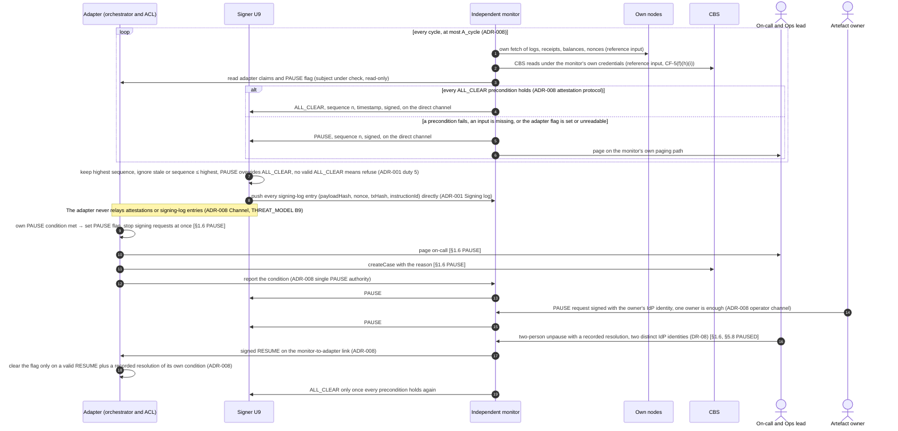

- **Inbound during PAUSE.** Inbound detection continues, except under an RPC disagreement (F2) [§1.6]. Items keep their states and funds, and §5.8 ages keep running [§1.6].
- **QUARANTINE(item)** stops one item, pages on-call and opens a case [§1.6]. Its exits are a two-person resolution **recorded by the monitor**: `RESUME`, `CONFIRM_APPLIED`/`CONFIRM_ABSENT` (F1), `RELEASE` (T5, with proof) or `ESCALATE` (→ PAUSE). Past `A_quarantine` (4 h) it becomes a PAUSE [§1.6, §5.8].
- **CONTRACT silent:**
  - CONTRACT §1.6 doesn't yet name the monitor as the single PAUSE authority, or unpause through the monitor. That is **CF-9(a)**, so the monitor's role here rests on ADR-008.
  - Neither CONTRACT nor ADR-008 says how a QUARANTINE resolution recorded by the monitor reaches the adapter, or how the adapter authenticates it. ADR-008 defines `RESUME` only for the adapter's PAUSE flag. That is **CF-26**, so no delivery step is drawn here or in F1.

---

## S1 Inbound deposit → CBS credit

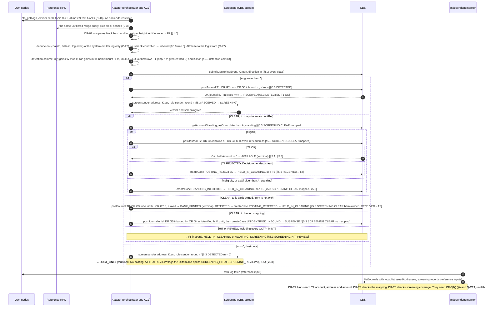

- **CCTP mint (§5.3, §5.2).** A mint has `from = 0x0` (CCTP domain 26, C-60). It is screened with `kind: CCTP_MINT`, which is always REVIEW, so it opens `MINT_UNATTRIBUTED` and enters AWAITING_SCREENING. Only a `ScreeningOutcome CLEAR` for the current round moves it on, by its `to`:
  - bank-owned → T8;
  - mapped to an account → `getAccountStanding`, then T2 or `STANDING_INELIGIBLE`;
  - unmapped → `unid` and SUSPENSE.

  A mint is never routed to T8 because of its sender.
- **CBS binding.** T2's account is bound by the CBS to its own issuance record for `refs.address` (§3, CF-16). The on-chain amount is bound only by the monitor (DR-29). Whether the CBS can bind is **Q-C19**.
- **Rows that don't apply.** Zero-value transfers and self-transfers emit no log (C-24), so they never reach DETECTED. A log that is neither from nor to a bank address is ignored [§5.0 rule 4]. If a query hits the `-32602` result cap, the range is shrunk (C-41, M-2, Q-A4).
- **Fact-class failures.** T1 or `unid` REJECTED → PAUSE [§1.5 Fact]. DETECTED older than `A_post` (15 min) → PAUSE. RECEIVED or SCREENING older than `A_decide` (15 min) → QUARANTINE [§5.8].
- **CONTRACT silent:** v3 has **no inbound travel-rule step**. That is **Q-R9** and **CF-4(a)**, so none is drawn.
- **Omitted §5.3 rows:** AWAITING_SCREENING, HELD_IN_CLEARING and the late-outcome row (drawn in F5); SUSPENSE and SUSPENSE_ASSIGNING (listed under F5).

---

## S2 Outbound payout

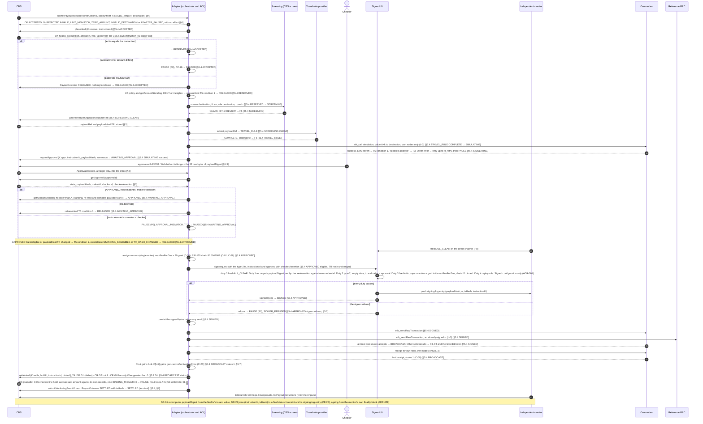

- **Hold fallback.** If the CBS can't hold without expiry (P3.5), the T3, T4 and T5 fallback journals of §5.1 replace `placeHold`, `settleHold` and `releaseHold` one for one [§3 placeHold].
- **Ages [§5.8]:**
  - ACCEPTED: `A_reserve` 5 min → QUARANTINE.
  - RESERVED to SIMULATING: `A_checks` 30 min → T5 condition 1.
  - AWAITING_APPROVAL: `A_approval` 24 h → T5 condition 1 with `APPROVAL_EXPIRED`.
  - APPROVED: `A_sign` 5 min → re-run the standing check, and past 2×`A_sign` → QUARANTINE.
  - SIGNED: `A_broadcast` 1 min → PAUSE.
  - BROADCAST: `T_pending` → F4, and `A_stuck` 30 min → PAUSE.
  - Settlement not OK after a final status 1: `A_post` 15 min → PAUSE.
- **Fee.** The fee is part of the CBS's own instruction and is taken by `placeHold`. `fee` is 0 unless Q-C8 = yes (§5.1).
- **Open values.** `T_pending` and `H_retry` have no value yet (Q-C17).
- **Omitted §5.4 rows:**
  - AWAITING_SCREENING and HELD_FOR_CASE (F5, F6);
  - SIMULATING `"Blocked address"`, SIGNED `"Blocked address"`, CANCELLING, and BROADCAST status 0 (F3);
  - BROADCAST no receipt, cancel final, and the nonce-drift rows (F4);
  - SIGNED `transaction underpriced` (→ PAUSE, DR-16 part (1)), SIGNED `-32014`/transient (resend the same bytes up to `A_broadcast`), SIGNED other rejection (→ PAUSE), SIGNED mixed results (severity order), and PAUSED (P0).

---

## S3 Internal treasury move and gas top-up

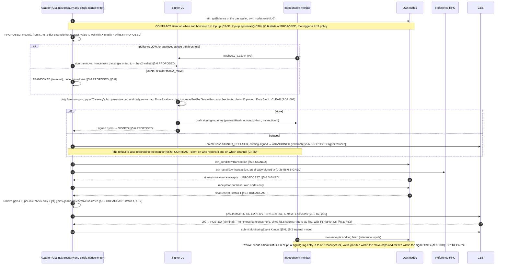

- **Approval above the threshold.** CONTRACT says only "approved above threshold" [§5.6]. ADR-001 duty 6 sets the boundary (at or below: no checker; strictly above: a checker assertion). **CONTRACT silent** on that boundary and on the approval route for a move, since `requestApproval` and `payloadDigest` are keyed by `instructionId` (§1.3). That is **CF-15**.
- **Per-role check.** The ±Rmove per-role check is diagnostic only in §5.7. Making it PAUSE is **CF-5(b)**.
- **T6 units.** §5.1 writes T6 as `X` with no unit tag, so **CONTRACT is silent** on the unit of the T6 journal. That is **CF-29**. This diagram reads the posting through U1 (§6) as `X/k` minor units, which is exact because `X mod k = 0` [§5.6].
- **Bank funding.** Funding from outside, for example a CCTP mint to a bank-owned wallet, follows S1 into T8 and G7. **CONTRACT silent** on CCTP outbound rebalancing, which has no flow. That is **CF-35**, so none is drawn.
- **Ages [§5.8]:** PROPOSED `A_move` 30 min → ABANDONED. SIGNED `A_broadcast` 1 min → PAUSE. BROADCAST `T_pending` → F4, and `A_stuck` 30 min → PAUSE. Final but T6 not OK: `A_post` 15 min → PAUSE.
- **Omitted §5.6 rows:** SIGNED `"Blocked address"` and CANCELLING (as in F3, but ending in FAILED with no T6); BROADCAST status 0 (→ gas to F, `BLOCKLIST_REVERT`, FAILED); BROADCAST no receipt, cancel final and drift (F4); SIGNED underpriced, transient and mixed (as in S2); PAUSED (`RESUME`, `POSTED` with T6 at `attempt + 1`, or `FAILED`).

---

## S4 Fees

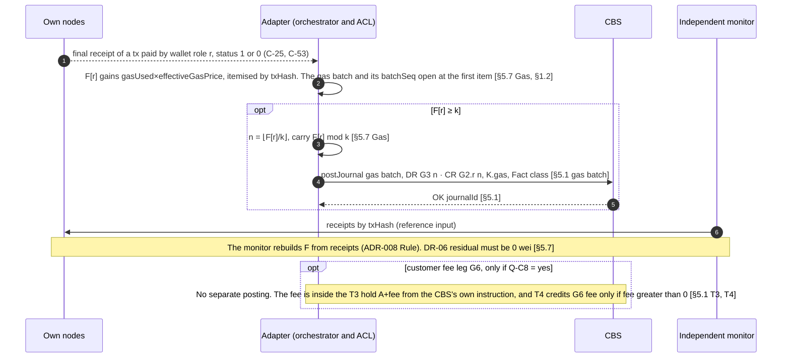

- **Ages and checks.** `F[r] ≥ k` with no batch for `A_batch` (24 h) → PAUSE [§5.8]. A gas batch REJECTED → PAUSE [§1.5 Fact]. The bank funds gas through T8 into G7, checked by `G7 ≥ cumulative G3` [§5.7] (Q-C16).
- **CONTRACT silent:**
  - the gas rounding policy is **Q-C5**;
  - §5.7 doesn't say whether `F[r]` drops to `F[r] mod k` when the batch is committed locally or when it is OK. That is **CF-28**, so this diagram doesn't decide it.
- **Fee display.** U11 fee display (USDC plus ZAR, never 18 dp) is outside CONTRACT; the ZAR source is Q-C15.

---

## S5 Dust batch

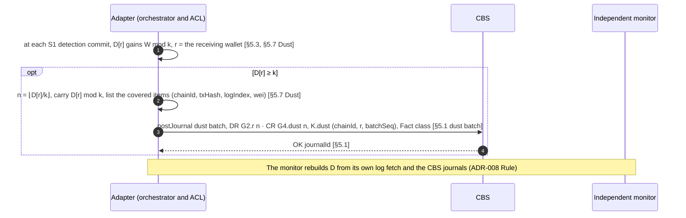

- **Ages and failures.** `D[r] ≥ k` with no batch for `A_batch` (24 h) → PAUSE [§5.8]. A dust batch REJECTED → PAUSE [§1.5 Fact].
- **Flagged dust.** A DUST_ONLY item flagged by a HIT or REVIEW stays in D until its treatment is decided (Q-C5) [§1.7].
- **CONTRACT silent:**
  - Who owns dust is **Q-C5**.
  - Whether a flagged item may be included in a batch is also open under **Q-C5**.
  - A `D ≥ 0` check is **CF-5(d)**.
  - As for F, the step at which `D[r]` drops to `D[r] mod k` isn't stated. That is also **CF-28**.

---

## Failure and compensation paths

### F1 CBS timeout or AMBIGUOUS result (any keyed operation)

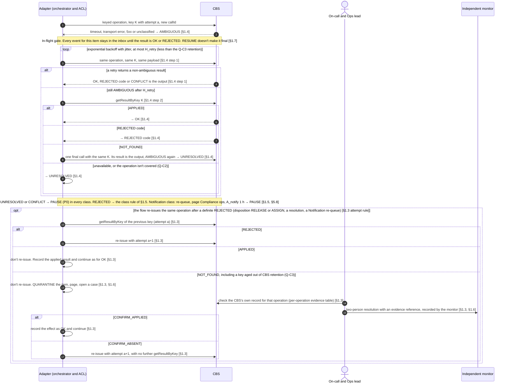

- **Exits.** These are the only exits from the NOT_FOUND quarantine, so it can't loop [§1.3]. An unresolved QUARANTINE escalates to PAUSE after `A_quarantine` (4 h) [§5.8].
- **REJECTED by class [§1.5]:**
  - Decision: compensates (for example `placeHold` → RELEASED, `screen` → QUARANTINE).
  - Release: QUARANTINE.
  - Fact: PAUSE, and the item stays in its pending term and ages.
  - Decision-then-fact: held state with a case.
  - `BINDING_MISMATCH` → PAUSE in every class.
- **Values.** `H_retry` has no value yet (Q-C17).

### F2 RPC disagreement

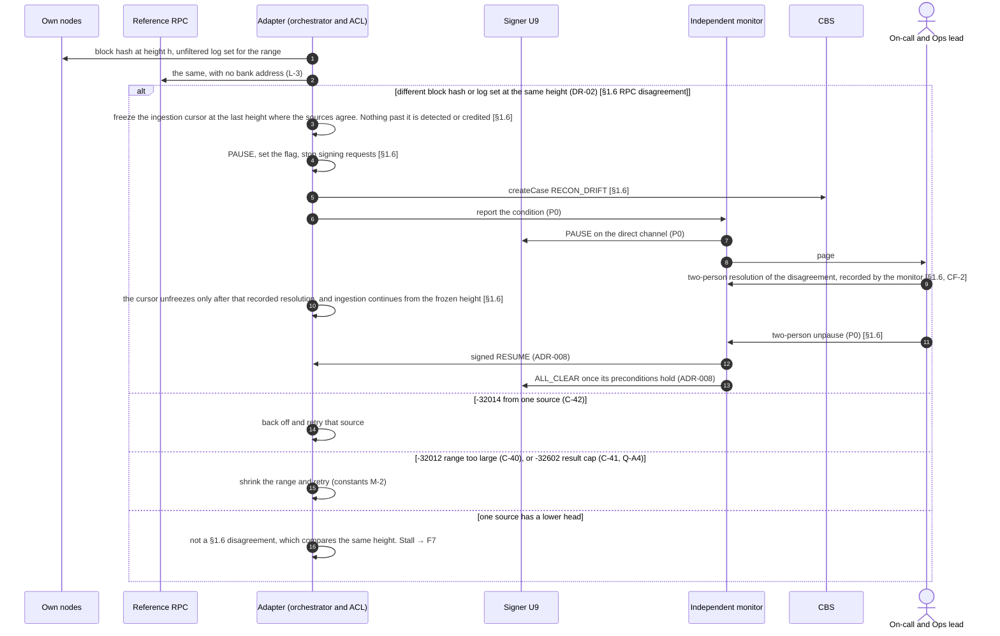

- **Scope of the compare.** Finality is deterministic with no reorgs (C-50), so a disagreement at a height both sources have is never normal. Block hashes and unfiltered log sets are compared between own nodes and the reference. Address-specific reads go to own nodes only, and with one own node they are single-source, cross-checked by DR-10 (L-3).
- **CONTRACT silent:**
  - §1.6 doesn't define what the two-person resolution records: which source was right, and whether the frozen height is kept or changed. That is **CF-27(a)**. This diagram shows only that a recorded resolution unfreezes the cursor (CF-2).
  - §1.6 also doesn't say whether that resolution and the rail unpause are one act. That is **CF-27(b)**. They are drawn as two steps.

### F3 Blocklist pre-check and blocklist revert (payout shown)

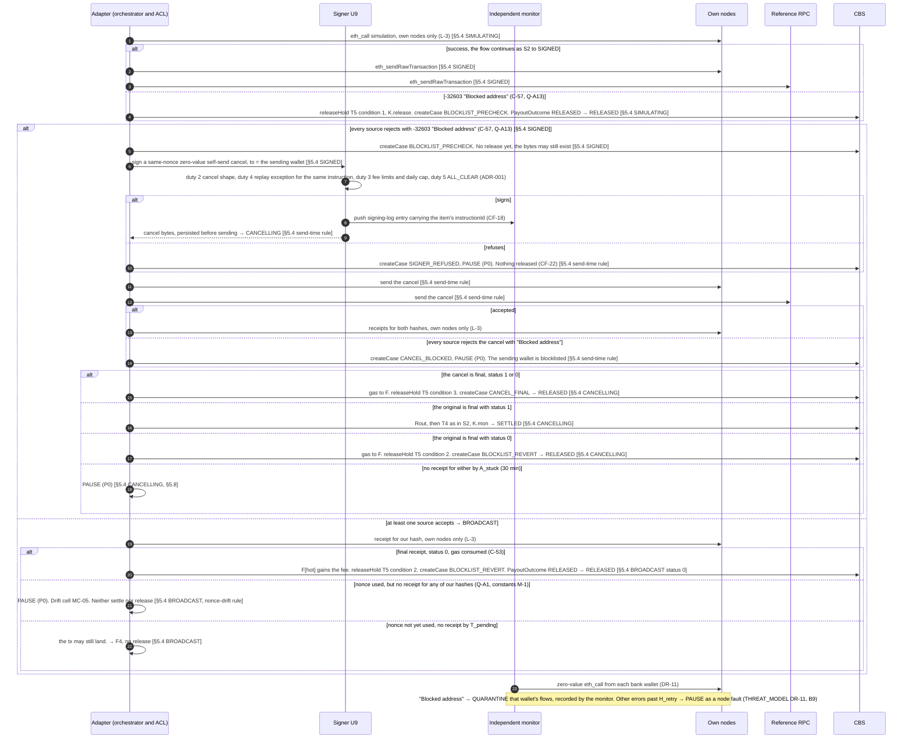

- **Mixed send results.** If no source accepts and the results differ, the most severe result applies, in this order: other rejection > `transaction underpriced` > `"Blocked address"` > transient [§5.4 SIGNED mixed].
- **Replacement.** A replacement rejected with `"Blocked address"` by every source takes this cancel path [§5.4 send-time rule].
- **Case returns and moves.** The same rows exist for case returns (RET_SIMULATING, RET_SIGNED, RET_CANCELLING, RET_BROADCAST) and moves (§5.6). There, every compensation is the **source held state with `RETURN_FAILED`** [§5.5] or **FAILED** [§5.6], never T5. Those rows are omitted here.
- **Receipt shape.** Whether a blocklist revert gives a `status: 0` receipt or no receipt is **Q-A1** (constants M-1). Both are drawn.
- **Release rule.** "Not seen" never releases [§5.4 T5 conditions].

### F4 Stuck nonce or dropped transaction

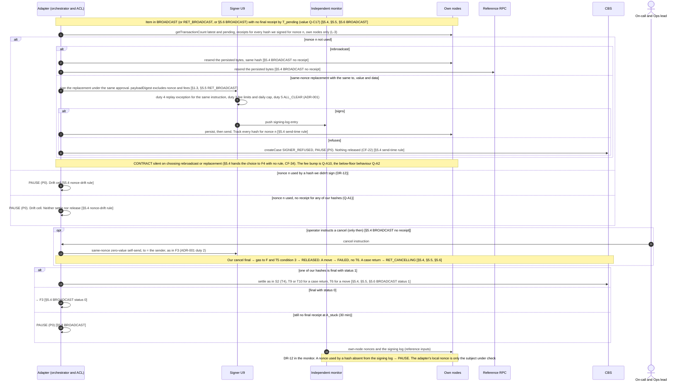

- **Release rule.** "Dropped", "not seen" and "timed out" never count as a T5 condition. Release needs exactly one of conditions 1–3 [§5.4] (constants M-6).
- **Nonce drift.** The drift rows apply in **every** state where signed bytes exist: SIGNED, BROADCAST, CANCELLING, their RET_ forms, and the §5.6 states [§5.4 nonce-drift rule].
- **Silent drops.** A send that is accepted and then silently dropped gives no error. It reaches this path at `T_pending` and PAUSEs at `A_stuck` (DR-16 part (1); constants C-30 and M-4; Q-A2).
- **CONTRACT silent:** how an operator's cancel instruction reaches the adapter, who may give it, and which identity check it carries. That is **CF-31**, so the `OC->>AD` step names no channel.

### F5 Screening hit

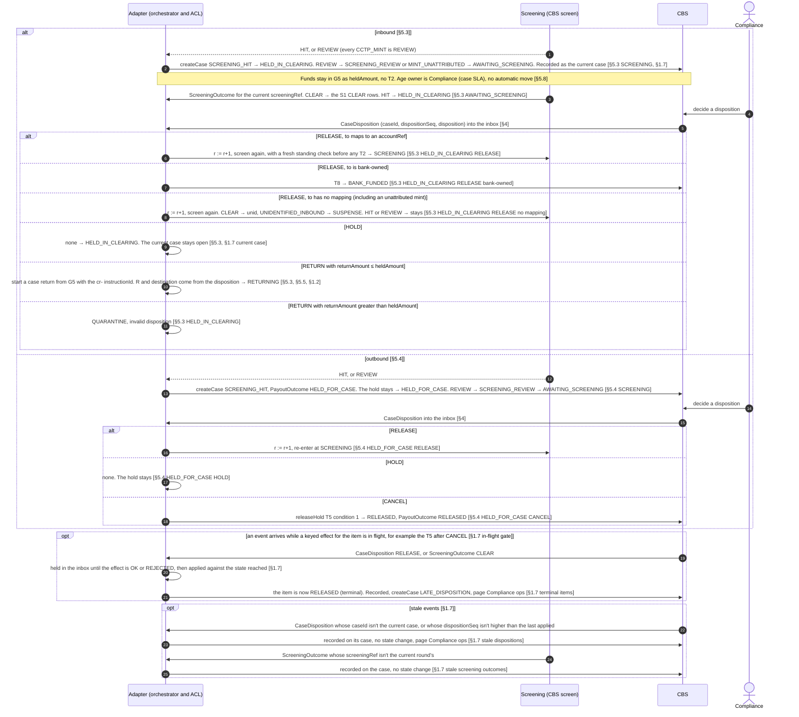

- **Current case.** A disposition doesn't close the current case. It stays current until the item leaves its held state family or a newer case replaces it. So after HOLD, `RETURNED_PARTIAL` or a `RETURN_FAILED` resolution, the same case still accepts dispositions [§1.7 current case]. DUST_ONLY dispositions are recorded on the case with no `LATE_DISPOSITION` [§1.7].
- **Never held.** QUARANTINE and PAUSE triggers are never held by the gate, and nor is `AccountStatusChanged` [§1.7 never held].
- **Who decides.** The adapter never chooses a disposition. Freeze versus return or cancel after a TFS hit is **Q-R8**.
- **Omitted rows:**
  - §5.3 SUSPENSE (`ASSIGN` → SUSPENSE_ASSIGNING, `RETURN` from G4, `HOLD`);
  - every SUSPENSE_ASSIGNING row (T11 or back to SUSPENSE with a case);
  - the HELD_IN_CLEARING late-outcome row;
  - the whole §5.5 case-return table. A case return runs screening, travel rule, simulation, approval and signing like S2, but has no hold, no standing check and no T5. Every pre-finality failure returns to the source held state, and success posts T9 (from G5) or T10 (from G4) and ends RETURNED or RETURNED_PARTIAL.

### F6 Travel-rule data missing

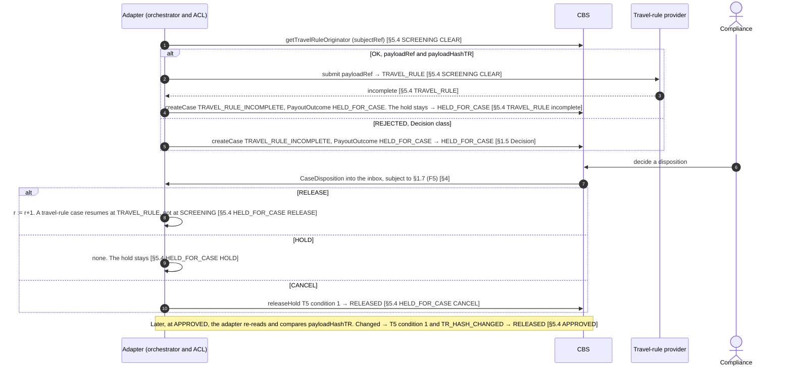

- **Case return.** RET_TRAVEL_RULE incomplete → `TRAVEL_RULE_INCOMPLETE`, a `PayoutOutcome`, and the source held state, with no T5 [§5.5]. The bank as originator for a return is **Q-R9**.
- **CONTRACT silent:**
  - whether resuming at TRAVEL_RULE re-reads `getTravelRuleOriginator` or re-submits the stored `payloadRef` is **CF-32**;
  - comparing `payloadHashTR` with the travel-rule system's reported digest (DR-18) is **CF-5(e)**;
  - the field list and threshold are **Q-R3**;
  - the inbound travel-rule check is **Q-R9** and **CF-4(a)**;
  - the R5 000 tier is **CF-4(b)** and **Q-R10**;
  - a counterparty acknowledgement is **CF-24** and **Q-D9**.

### F7 Chain stall

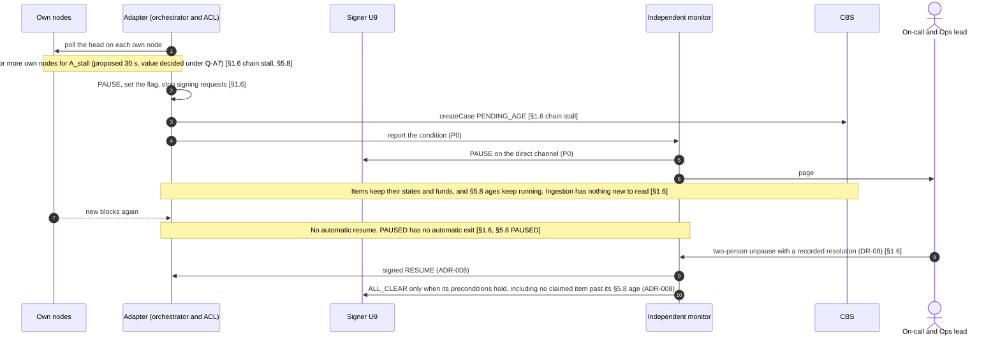

- **Signed bytes during a stall.** Signed bytes sent before the stall may still land once blocks resume. §5.0 rule 2 still matches them, and their item rows apply.
- **CONTRACT silent:** CONTRACT §1.6 doesn't yet say that the unpause goes through the monitor. That is **CF-9(a)**, which names F7, so the monitor steps rest on ADR-008. Liveness needs more than two-thirds of validators online (C-51); the docs give no stall threshold (M-7).

---

## Mapping to KICKOFF §5 item 2

| Diagram | KICKOFF §5 Phase 1 item 2 bullet | CONTRACT sections |
|---|---|---|
| P0 | (supports every failure and compensation path) | §1.6, §5.8 PAUSED and QUARANTINED; ADR-001 duty 5; ADR-008 |
| S1 | Inbound deposit: a merchant or customer receives USDC on Arc → credit in the CBS | §1.3, §5.0, §5.1 (T1, T2, T8, unid), §5.2, §5.3, §5.7, §5.8 |
| S2 | Outbound payout/withdrawal | §1.3, §3, §4, §5.1 (T3, T4, T5), §5.2, §5.4, §5.8 |
| S3 | Internal treasury moves and gas top-up | §5.1 T6, §5.6, §5.7, §5.8 |
| S4 | Fees | §5.1 (T3, T4, gas batch), §5.7 Gas, §5.8 |
| S5 | Fees (sub-unit dust, KICKOFF money invariants) | §5.1 dust batch, §5.3, §5.7 Dust, §1.7 |
| F1 | Failure path: CBS timeout | §1.3, §1.4, §1.5, §1.6, §1.7 |
| F2 | Failure path: RPC disagreement | §1.6, §5.0 |
| F3 | Failure path: blocklist revert | §5.4 (SIMULATING, SIGNED, CANCELLING, BROADCAST, send-time rule, nonce-drift rule), §5.5, §5.6 |
| F4 | Failure path: stuck nonce | §1.3, §5.4 (BROADCAST, send-time rule, nonce-drift rule, T5 conditions), §5.5, §5.6, §5.8 |
| F5 | Failure path: screening hit | §1.7, §4, §5.3, §5.4, §5.5 |
| F6 | Failure path: travel-rule data missing | §1.5, §3, §5.4, §5.5 |
| F7 | Failure path: chain stall | §1.6, §5.0, §5.8 |
