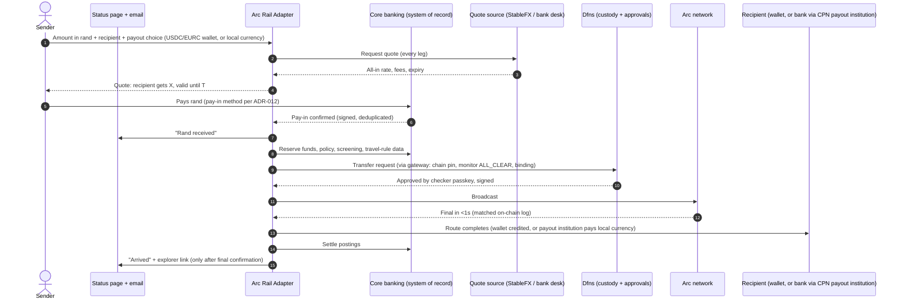

> **Raayl note (6 Oct):** the build order is now milestones D1–D7 in `CHANGE_ORDER.md` (CO-1 v3), following the boss's strategy note. Part A's journeys still apply, except that fiat conversion runs through the existing OTC/VALR engine, and StableFX/CPN are deferred.

# Arc rail: the total process (v2, 6 Oct 2026)

Status labels: **designed** means specified in this kit and not yet proven in code. Facts are cited in the research report and in `docs/sources.md` once Claude Code fills it.

## Part A: What the system does once built

### A1. Sender journey (the boss's proof of concept)

What people see:
- **Sender:**
  - one all-in quote with an expiry;
  - a live status page;
  - an email at each step;
  - a refund explanation if anything fails.
- **Recipient:**
  - funds in their wallet (USDC or a swapped stablecoin), or local currency in their bank account (CPN route, once the bank has joined);
  - an explorer link they can check themselves.
- **Approvers:** a Dfns passkey prompt for payouts above the threshold.
- **Compliance:**
  - screening hits as cases in the existing system;
  - travel-rule data captured automatically (full set, or the reduced set below R5,000, per Directive 9; verify the text);
  - exchange-control data captured.
- **Operations:**
  - rail health;
  - three-way reconciliation: chain ↔ adapter ↔ CBS, with Dfns as a cross-check;
  - automatic PAUSE on any disagreement;
  - two-person unpause.

### A2. Other journeys
- **Merchant deposits:** an Arc address created in Dfns → incoming USDC is screened → credited in the CBS.
- **Treasury:** gas wallet top-ups and float management, all under Dfns policies.

### A3. What it deliberately won't do
- **Reverse a sent payment.** Arc finality is final.
- **Hide anything on-chain.** Arc privacy is not live, so no PII goes on-chain.
- **Keep going when numbers disagree.** It pauses instead.
- **Send cross-border on mainnet** before counsel signs off.
- **Use mainnet at all** before its gates are signed.

### A4. Payout options

| Recipient gets | Route | Partner | Needed before the demo |
|---|---|---|---|
| USDC in a wallet | OnchainDirect | Arc (direct) | Nothing extra |
| Another stablecoin (e.g. EURC) | SwapThenWallet | Circle StableFX (RFQ, payment-versus-payment) | StableFX sandbox API key from Circle |
| Local currency in a bank account | FiatPayout | Circle Payments Network; the bank is the sending institution | CPN participation agreement; corridor availability |

## Part B: How it gets built

### B1. Phases and who signs

| Step | What happens | Signs | Status (per 5 Oct brief) |
|---|---|---|---|
| G0 | Discovery: Arc facts, CBS map | Sunshine | Passed |
| G1 | Original design | Sunshine | Approved in chat, not recorded |
| **CO-1** | Change order: Dfns, quote, routes, notifications, pay-in, pilot profile | n/a | **Next** |
| G1b | Updated design packet | Sunshine (+ boss for scope) | After CO-1 |
| G2 | Skeleton + CI + port isolation proven | Sunshine | Phase 2 in progress |
| PoC slice | U1, U2, U3, U17, U18, U9, U19 (USDC), U10, U16, U12 on testnet | Verifier per unit | Not started |
| Rest of units | U4–U8, U11, U13–U15, U19 (swap/fiat), U20 | Verifier per unit | Not started |
| G3 | Testnet demo + evidence pack | Sunshine + boss | Not started |
| G-P | Mainnet pilot (bank funds, tiny caps) | Compliance, counsel, security, Dfns admin, boss | Not started |
| G-M | Full service | Compliance, counsel, FSCA/FIC, bank partner, boss | Not started |

### B2. What's needed from whom (blocking items in bold)

| From | What |
|---|---|
| **Khumo / CBS team** | **Exact CBS product and version; integration docs; UAT access; existing notification service; capability checklist answers** |
| **Dfns admin** | **Testnet service account(s) with least privilege; ArcTestnet wallets; draft policies (approvals, limits); webhook + secret; org region and data residency answer** |
| **Circle** | StableFX sandbox API key (swap route, RFQ); CPN participation (fiat route) |
| Boss | Which payout routes and corridors matter; pilot yes or no; pay-in method |
| Compliance / counsel | Confirm the G-P list; licensing coverage; cross-border opinion; Directive 9 approach |
| Ops / security | Secret store; Proxmox VMs for nodes and monitor; email sending domain (SPF/DKIM/DMARC) |

### B3. Credentials checklist (none of these ever go to Claude Code)
- **Dfns:** service account key pairs and tokens (separate for adapter, monitor and gateway; separate for testnet and mainnet), approver passkeys and offline recovery credentials, webhook secret, app ID if your org needs one.
- **Arc:** RPC (public needs no key; a paid provider needs one) and mainnet USDC for gas and float (pilot only).
- **Circle:** StableFX and CPN API keys.
- **Others:** screening provider, travel-rule provider, email/DKIM, CBS integration credentials.
- **Ours:** monitor attestation key and config-owner signing keys, both HSM-backed.

## Part C: Which file to use
- **Project already running:** paste `CHANGE_ORDER.md` into the existing Claude Code session.
- **Fresh repo:** use `KICKOFF_PROMPT.md` (v2) with this kit's `CLAUDE.md` and `.claude/`.
