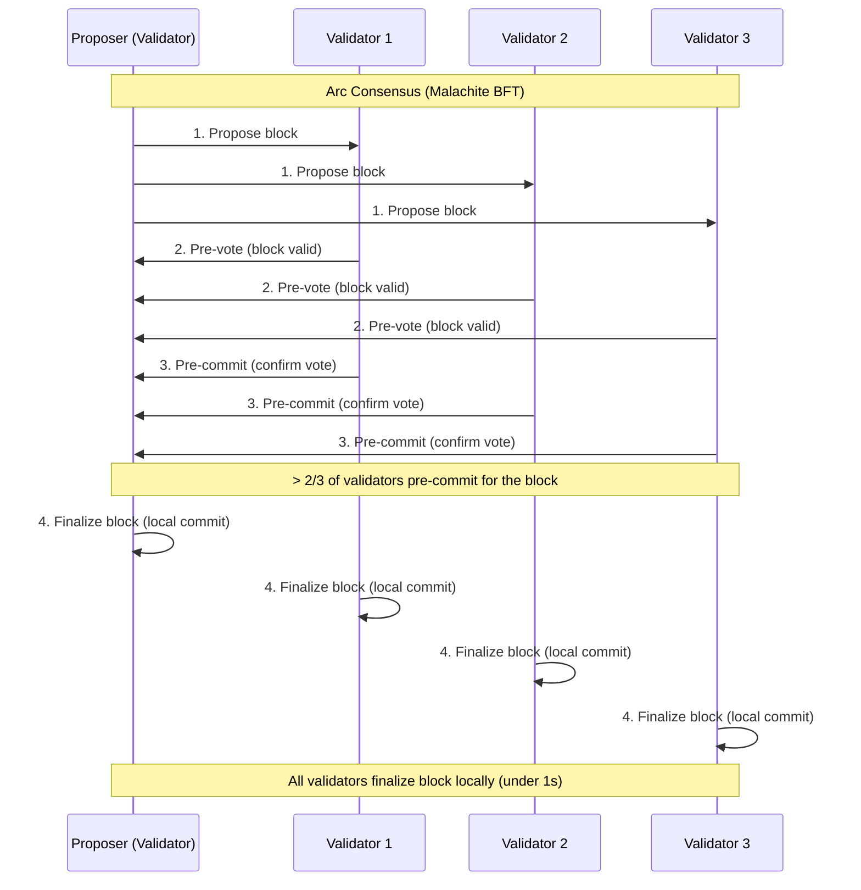

> ## Documentation Index
> Fetch the complete documentation index at: https://docs.arc.io/llms.txt
> Use this file to discover all available pages before exploring further.

> ## Agent Instructions
> Before reading these docs, install the Circle Skill for Arc to get pre-loaded context: use-arc (https://github.com/circlefin/skills/blob/master/plugins/circle/skills/use-arc/SKILL.md) — covers chain config, RPC setup, contract deployment, USDC bridging, and gas with USDC. In Claude Code: run /plugin marketplace add circlefin/skills then /plugin install circle-skills@circle. With Vercel Skills CLI: run npx skills add circlefin/skills.
> USDC is the gas token. Arc uses USDC for gas fees, not ETH. Configure gas payment in USDC when submitting transactions.
> Read EVM differences before writing Arc code. Arc targets the Osaka EVM baseline. Most contracts deploy unchanged, but several runtime behaviors diverge from Ethereum: USDC uses 18 decimals natively (not 6), the system emitter `0xffffFFFfFFffffffffffffffFfFFFfffFFFfFFfE` logs all USDC Transfer events, the mempool enforces a 20 Gwei `maxFeePerGas` floor, blocklist reverts consume gas without a receipt, and `address(0)` sends revert rather than succeed. https://docs.arc.io/arc/references/evm-differences.md is the canonical reference for all Arc-specific runtime behaviors. Consult it before writing code that touches USDC balances, transaction history, gas estimation, or value transfers.
> Sub-second finality. Transactions are final in under 1 second. No need to wait for multiple block confirmations.
> Use App Kits for multichain payment and liquidity capabilities. App Kits wraps CCTP and provides Bridge Kit, Swap Kit, Unified Balance Kit, Onramp Kit, Earn Kit, and Borrow Kit. Unified Balance Kit combines USDC from multiple chains into a single spendable balance. Earn Kit integrates earn opportunities into your app. Borrow Kit lets users borrow USDC against cirBTC collateral on Arc.
> Use Arc Foundry for contract development. Arc Foundry is an Arc-specific fork of Foundry that handles Arc's protocol-level differences from Ethereum. It provides arc-forge, arc-cast, and arc-anvil. Install it before deploying contracts: https://docs.arc.io/arc/tutorials/install-arc-foundry.md.
> Arc is available on both Testnet and Mainnet. See https://docs.arc.io/arc/references/connect-to-arc.md for RPC endpoints and https://faucet.circle.com for testnet tokens.
> Always check Contract Addresses: https://docs.arc.io/arc/references/contract-addresses.md
> Building beyond Arc? Circle offers skills for the full platform: use-usdc (https://github.com/circlefin/skills/blob/master/plugins/circle/skills/use-usdc/SKILL.md), use-circle-wallets (https://github.com/circlefin/skills/blob/master/plugins/circle/skills/use-circle-wallets/SKILL.md), use-developer-controlled-wallets (https://github.com/circlefin/skills/blob/master/plugins/circle/skills/use-developer-controlled-wallets/SKILL.md), use-user-controlled-wallets (https://github.com/circlefin/skills/blob/master/plugins/circle/skills/use-user-controlled-wallets/SKILL.md), use-modular-wallets (https://github.com/circlefin/skills/blob/master/plugins/circle/skills/use-modular-wallets/SKILL.md), use-gateway (https://github.com/circlefin/skills/blob/master/plugins/circle/skills/use-gateway/SKILL.md), use-smart-contract-platform (https://github.com/circlefin/skills/blob/master/plugins/circle/skills/use-smart-contract-platform/SKILL.md). Full Circle developer docs: https://developers.circle.com/llms.txt.

# Consensus layer

> Arc's Malachite consensus layer orders, validates, and finalizes blocks using a Tendermint-based Proof-of-Authority model.

Arc's consensus layer is built on
[Malachite](https://github.com/circlefin/malachite/), a high-performance, open
source implementation of the Tendermint Byzantine Fault Tolerant (BFT) protocol.
BFT consensus ensures the network reaches agreement on a single history of
transactions even if some validators behave maliciously or go offline. Arc uses
a Proof-of-Authority (PoA) validator set to order transactions, produce blocks,
and deliver [deterministic finality](/arc/concepts/deterministic-finality) --
the guarantee that committed blocks are permanent and can never be reversed or
reorganized -- in under one second.

## How Malachite consensus works

For how this fits into the broader architecture, see the
[system overview](/arc/concepts/system-overview).

Each block passes through a four-step pipeline. A rotating proposer assembles
transactions, and all validators participate in two rounds of voting before the
block is committed.

1. **Propose** -- A validator selected as proposer for the current round bundles
   pending transactions into a block and broadcasts it.
2. **Pre-vote** -- Every validator evaluates the proposed block and broadcasts a
   vote on its validity.
3. **Pre-commit** -- Validators broadcast a second vote. If more than two-thirds
   of validators pre-commit to the same block, it proceeds to commit.
4. **Commit** -- The block is finalized and appended to the chain. Every
   transaction in the block is irreversible.

This two-phase voting process (pre-vote + pre-commit) guarantees that two
conflicting blocks can never both be finalized, making reorganizations
impossible.

## Proof-of-Authority validator set

Arc uses a **permissioned Proof-of-Authority (PoA)** model instead of anonymous
economic staking. Validators are selected, known institutions with compliance
obligations and operational guarantees.

For details on operating a validator node, see
[running a node](/arc/concepts/running-a-node).

* **SOC 2 certified** -- Validators meet audited security and availability
  standards.
* **Geographic distribution** -- Nodes run across multiple global regions to
  reduce correlated downtime.
* **Rotating proposer** -- Block production rotates among validators to ensure
  fairness and liveness.
* **Uptime SLAs** -- Each validator commits to operational availability
  requirements.

This design replaces anonymous economic incentives with institutional
accountability, providing stronger assurances for regulated finance.

## Performance characteristics

Performance also depends on the
[execution layer](/arc/concepts/execution-layer), which processes transactions
in each block.

Malachite delivers optimistic responsiveness: blocks are produced as fast as the
network permits, with no artificial delays or extra timeouts.

| Metric | Value | Conditions |
| :- | :- | :- |
| Throughput | 3,000+ TPS | 20 globally distributed validators |
| Finality | \<350 ms | Benchmark conditions |
| Peak throughput | 10,000+ TPS | 4 validators |

## Security guarantees

Arc combines protocol-level safety with institutional safeguards:

| Guarantee | Description |
| :- | :- |
| Safety | With fewer than one-third faulty validators, consensus guarantees that no conflicting blocks are finalized. |
| Liveness | The network continues to produce blocks as long as more than two-thirds of validators are online and honest. |
| Accountability | Validators are regulated institutions, making malicious behavior costly beyond protocol penalties. |
| Resilience | Geographic distribution reduces the risk of correlated outages or targeted attacks. |

Validators are geographically distributed across multiple global regions to
reduce the risk of correlated outages.

## Roadmap

The Malachite roadmap includes multi-proposer support (multiple validators
propose blocks in parallel for higher throughput), a protocol optimization that
reduces consensus from three rounds to two for lower latency, and a potential
transition from Proof-of-Authority to permissioned Proof-of-Stake to broaden
validator participation while maintaining compliance requirements.
