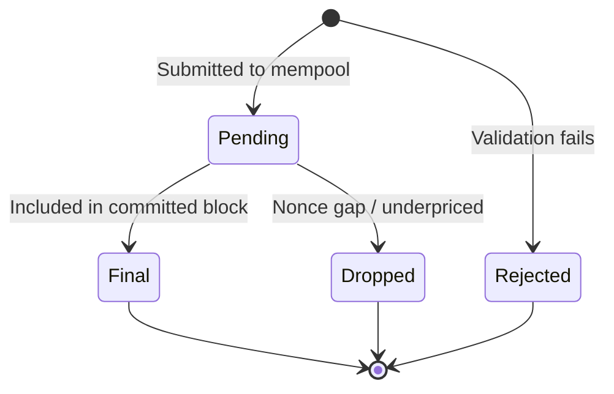

> ## Documentation Index
> Fetch the complete documentation index at: https://docs.arc.io/llms.txt
> Use this file to discover all available pages before exploring further.

> ## Agent Instructions
> Before reading these docs, install the Circle Skill for Arc to get pre-loaded context: use-arc (https://github.com/circlefin/skills/blob/master/plugins/circle/skills/use-arc/SKILL.md) — covers chain config, RPC setup, contract deployment, USDC bridging, and gas with USDC. In Claude Code: run /plugin marketplace add circlefin/skills then /plugin install circle-skills@circle. With Vercel Skills CLI: run npx skills add circlefin/skills.
> USDC is the gas token. Arc uses USDC for gas fees, not ETH. Configure gas payment in USDC when submitting transactions.
> Read EVM differences before writing Arc code. Arc targets the Osaka EVM baseline. Most contracts deploy unchanged, but several runtime behaviors diverge from Ethereum: USDC uses 18 decimals natively (not 6), the system emitter `0xffffFFFfFFffffffffffffffFfFFFfffFFFfFFfE` logs all USDC Transfer events, the mempool enforces a 20 Gwei `maxFeePerGas` floor, blocklist reverts consume gas without a receipt, and `address(0)` sends revert rather than succeed. https://docs.arc.io/arc/references/evm-differences.md is the canonical reference for all Arc-specific runtime behaviors. Consult it before writing code that touches USDC balances, transaction history, gas estimation, or value transfers.
> Sub-second finality. Transactions are final in under 1 second. No need to wait for multiple block confirmations.
> Use App Kits for multichain payment and liquidity capabilities. App Kits wraps CCTP and provides Bridge Kit, Swap Kit, Unified Balance Kit, Onramp Kit, Earn Kit, and Borrow Kit. Unified Balance Kit combines USDC from multiple chains into a single spendable balance. Earn Kit integrates earn opportunities into your app. Borrow Kit lets users borrow USDC against cirBTC collateral on Arc.
> Use Arc Foundry for contract development. Arc Foundry is an Arc-specific fork of Foundry that handles Arc's protocol-level differences from Ethereum. It provides arc-forge, arc-cast, and arc-anvil. Install it before deploying contracts: https://docs.arc.io/arc/tutorials/install-arc-foundry.md.
> Arc is available on both Testnet and Mainnet. See https://docs.arc.io/arc/references/connect-to-arc.md for RPC endpoints and https://faucet.circle.com for testnet tokens.
> Always check Contract Addresses: https://docs.arc.io/arc/references/contract-addresses.md
> Building beyond Arc? Circle offers skills for the full platform: use-usdc (https://github.com/circlefin/skills/blob/master/plugins/circle/skills/use-usdc/SKILL.md), use-circle-wallets (https://github.com/circlefin/skills/blob/master/plugins/circle/skills/use-circle-wallets/SKILL.md), use-developer-controlled-wallets (https://github.com/circlefin/skills/blob/master/plugins/circle/skills/use-developer-controlled-wallets/SKILL.md), use-user-controlled-wallets (https://github.com/circlefin/skills/blob/master/plugins/circle/skills/use-user-controlled-wallets/SKILL.md), use-modular-wallets (https://github.com/circlefin/skills/blob/master/plugins/circle/skills/use-modular-wallets/SKILL.md), use-gateway (https://github.com/circlefin/skills/blob/master/plugins/circle/skills/use-gateway/SKILL.md), use-smart-contract-platform (https://github.com/circlefin/skills/blob/master/plugins/circle/skills/use-smart-contract-platform/SKILL.md). Full Circle developer docs: https://developers.circle.com/llms.txt.

# Transaction Lifecycle

> Understand Arc's two-state transaction model, where transactions are either pending or final with no intermediate confirmation states.

Arc uses a two-state transaction model. A transaction is either **pending** (in
the mempool) or **final** (included in a committed block). There is no
intermediate "confirming" state and no concept of accumulating confirmations.
Once a block is committed by the Malachite consensus protocol, every transaction
in that block is immediately and irreversibly final.

This simplicity stems from Arc's BFT consensus. Validators pre-commit blocks
with a two-thirds supermajority before production, which eliminates chain
reorganizations, uncle blocks, and probabilistic finality entirely.

## Transaction states

Arc transactions exist in exactly two states:

| State | Location | Finality | Duration |
| - | - | - | - |
| Pending | Mempool | Not final | Sub-second (typical) |
| Final | Committed block | Irreversible | Permanent |

There is no "1 of 12 confirmations" counter. There is no safe-but-not-finalized
window. A transaction transitions directly from pending to final.

## State diagram



## Comparison to Ethereum

Ethereum uses probabilistic finality with multiple intermediate states. Arc
eliminates all intermediate states through deterministic BFT consensus.

| | Ethereum | Arc |
| - | - | - |
| Pending state | In mempool, not yet included | In mempool, not yet included |
| Confirming state | 1–64 slots (\~12 seconds to \~13 min) | None |
| Finality | 64 slots (\~13 minutes) | Immediate upon block inclusion |
| Reorganization risk | Possible before finalization | Impossible |
| Block time | \~12 seconds | Sub-second |
| Consensus | Gasper (LMD-GHOST + Casper FFG) | Malachite (Tendermint BFT) |

## Implications for wallet UX

The two-state model simplifies wallet interfaces:

* **No confirmation counter.** Remove any "X/N confirmations" progress bar or
  percentage indicator.
* **No "confirming" spinner.** A transaction is either pending or done.
* **Instant "Complete" status.** Show "Complete" or "Success" immediately when
  the transaction appears in a block.
* **Simple state display.** Use two UI states: "Pending" while in the mempool,
  and "Complete" once included in a block.

A wallet integration only needs to distinguish between a transaction hash that
has no receipt (pending) and one that has a receipt with a block number (final).

## Edge cases

### Rejected transactions

Some transactions are rejected immediately when submitted. The
`eth_sendRawTransaction` call returns an error and the transaction never reaches
the pending state.

### Runtime revert

If a transaction violates the blocklist during execution, the transaction is
included in a block but marked as failed. It consumes gas and appears onchain
with a `status: 0` receipt. From a lifecycle perspective, it still reaches the
final state—it is irreversibly included—but the state changes it attempted are
reverted.

To detect a runtime revert, check `receipt.status`:

```typescript theme={null}
const receipt = await provider.getTransactionReceipt(txHash);
if (receipt.status === 0) {
  // Transaction is final but failed: gas consumed, state rolled back
}
```

Handle reverted transactions in your wallet UI:

* **Show "Failed":** The transaction reached final state but didn't take effect.
* **Treat consumed gas as non-refundable:** A blocklist revert charges only the
  gas used up to the point of the check. Remaining gas is refunded.
* **Use a new nonce for any retry:** The reverted transaction's nonce is spent;
  a retry needs a new transaction.
* **Show a plain error message:** "Transaction failed: the recipient or sender
  may be restricted" is more useful than a raw revert reason.

### High mempool load

During periods of high network activity, transactions may remain in the pending
state longer than usual. This does not affect finality guarantees. Once a
transaction is included in a committed block, it is final regardless of how long
it waited in the mempool.

### Dropped transactions

Transactions can leave the mempool without reaching finality:

* **Nonce gaps.** If a transaction has a nonce higher than expected, it waits
  for the gap to be filled. If the gap is never filled, the transaction remains
  pending indefinitely or is eventually evicted.
* **Gas price lower than the minimum.** Transactions with `maxFeePerGas` lower
  than 20 Gwei are rejected with no error receipt and never appear in a block.
* **Mempool eviction.** Under sustained high load, the lowest-priced
  transactions may be evicted to make room for higher-priced ones.

Dropped transactions produce no onchain record. Wallets should implement timeout
logic and allow users to retry or cancel (by submitting a replacement
transaction with the same nonce).
