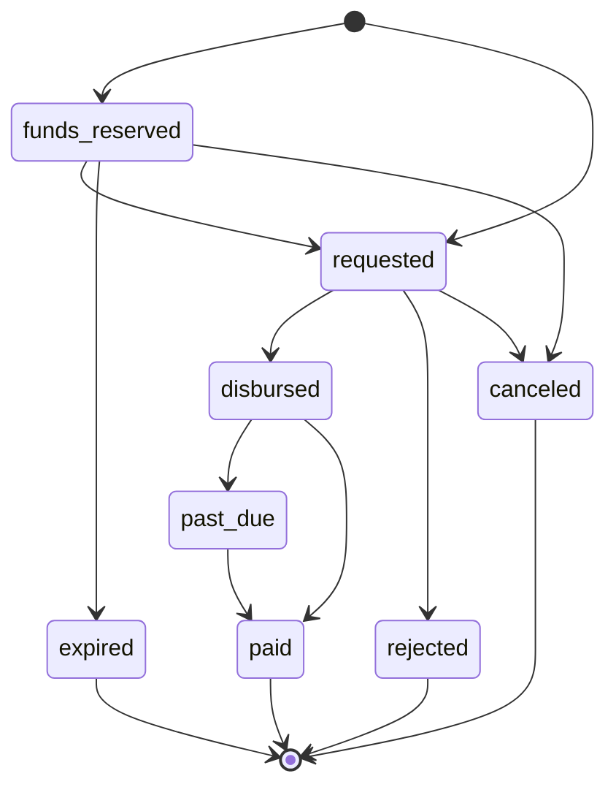

> ## Documentation Index
> Fetch the complete documentation index at: https://developers.circle.com/llms.txt
> Use this file to discover all available pages before exploring further.

> ## Agent Instructions
> Before reading these docs, install the relevant Circle Skill to get pre-loaded context — skills are LLM-optimized and cover architecture decisions, correct flows, and common pitfalls. In Claude Code: run /plugin marketplace add circlefin/skills then /plugin install circle-skills@circle. With Vercel Skills CLI: run npx skills add circlefin/skills. Available skills: use-usdc https://github.com/circlefin/skills/blob/master/plugins/circle/skills/use-usdc/SKILL.md (balances, transfers, approvals on EVM and Solana); EURC has no skill — see https://developers.circle.com/stablecoins/what-is-eurc.md; bridge-stablecoin https://github.com/circlefin/skills/blob/master/plugins/circle/skills/bridge-stablecoin/SKILL.md (crosschain transfers via CCTP, USDC, EURC, and third-party assets); use-arc https://github.com/circlefin/skills/blob/master/plugins/circle/skills/use-arc/SKILL.md (Arc chain config, contract deployment, USDC bridging — Arc docs: https://docs.arc.io/llms.txt); use-circle-wallets https://github.com/circlefin/skills/blob/master/plugins/circle/skills/use-circle-wallets/SKILL.md (choose wallet type); use-developer-controlled-wallets https://github.com/circlefin/skills/blob/master/plugins/circle/skills/use-developer-controlled-wallets/SKILL.md (custodial wallets for payouts and treasury); use-user-controlled-wallets https://github.com/circlefin/skills/blob/master/plugins/circle/skills/use-user-controlled-wallets/SKILL.md (embedded wallets with Web2 login); use-modular-wallets https://github.com/circlefin/skills/blob/master/plugins/circle/skills/use-modular-wallets/SKILL.md (smart contract wallets with passkeys and ERC-4337); use-gateway https://github.com/circlefin/skills/blob/master/plugins/circle/skills/use-gateway/SKILL.md (unified USDC balance, nanopayments); use-smart-contract-platform https://github.com/circlefin/skills/blob/master/plugins/circle/skills/use-smart-contract-platform/SKILL.md (deploy, interact, monitor contracts). Pair any skill with the Circle MCP server for live SDK signatures, contract addresses, and chain IDs: {"mcpServers":{"circle":{"url":"https://api.circle.com/v1/codegen/mcp"}}}.
> Read the product overview first. Each product has an overview explaining when and why to use it. Read it before quickstarts.
> Pick the right wallet type. Developer-controlled (you hold keys), user-controlled (end user holds keys via PIN/social login), or modular (smart contract wallets with passkeys). See https://developers.circle.com/wallets.md.
> Use CCTP V2 for crosschain transfers. CCTP natively transfers USDC and EURC via burn-and-mint, and supports permissionless wrapping of third-party assets via lock-and-mint. V1 is legacy; always use V2 unless V1 is specified or the chain requires it (Noble, Sui, and Aptos still require V1). Migration guide: https://developers.circle.com/cctp/migration-from-v1-to-v2.md.
> Use Bridge Kit for frontend bridging. Wraps CCTP with a simpler SDK for user-facing apps. Use CCTP directly for backend transfers.
> Gas Station vs Paymaster. Gas Station sponsors gas for Circle Wallet transactions. Paymaster lets users pay gas in USDC. Different use cases — read both overviews.
> Gateway Nanopayments for sub-cent payments. Gasless USDC micropayments down to $0.000001 via x402 and batched settlement. For pay-per-request APIs, AI agent payments, streaming.
> Look up USDC addresses per chain. Never hardcode — use https://developers.circle.com/stablecoins/usdc-contract-addresses.md.
> Prefer SDKs over raw API calls. Node.js and Python SDKs handle auth, retries, and errors.
> API key required. Bearer token in Authorization header. Testnet and mainnet use separate keys and may use different base URLs depending on the product.
> Set up webhooks when available. Most operations are async. Webhooks deliver transaction confirmations and state changes.
> When calling list endpoints, paginate using pageSize and pageAfter until no nextPageAfter cursor is returned—stopping at the first page silently misses records.
> Building an AI agent? Start with the Agent Stack—Circle CLI, agent wallets, and nanopayments built for autonomous use cases: https://developers.circle.com/agent-stack.md.

# StableFX settlement advance

> Understand how Settlement Advance lets a maker borrow local stablecoin inventory against a Circle-issued credit line to fund and instantly settle a confirmed StableFX trade.

Settlement Advance is a maker-facing credit facility in StableFX. An approved
maker borrows local stablecoin inventory, such as MXNB, against a Circle-issued
credit line to fund the maker side of a confirmed trade, instead of sourcing and
delivering that inventory themselves. Circle advances the funds through a
Circle-controlled funding wallet and the maker repays later. This lets a maker
settle instantly on currency pairs where they don't yet hold base-currency
inventory. Settlement Advance applies to per-trade instant settlement only; it
isn't used with net or batch delayed settlement.

Settlement Advance extends the maker funding model described in the
[StableFX technical guide](/stablefx/concepts/technical-guide). Instead of the
maker delivering their own funds to the `FxEscrow` contract, a Circle-controlled
funding wallet delivers the maker's leg on the maker's behalf through a
delegate-deliver path, and the maker authorizes that delivery with a signature.

## The credit line

Each approved maker has one credit line, represented by the
`SettlementAdvanceCredit` resource and retrievable through the
[Get settlement advance credit](/api-reference/stablefx/all/get-settlement-advance-credit)
endpoint. The credit line tracks the maker's borrowing limit, current usage, and
available headroom both overall and per currency. It also defines the fee
schedule that applies to advances, expressed in basis points (bps): a recurring
fee, a draw fee, and a reservation fee.

## Delegate funding

Settlement Advance is built on a delegate funding primitive on the existing
`FxEscrow` contract. Rather than calling the direct maker delivery path with
their own funds, the maker authorizes a Circle-controlled funding wallet to
deliver the maker's leg on their behalf.

The maker grants this authorization by signing a Uniswap Permit2
`PermitWitnessTransferFrom` payload whose `permitted.amount` is `0`. Because the
permitted amount is zero, no tokens ever leave the maker's wallet. Permit2 acts
purely as an authorization carrier, not as a transfer instruction.

The authorization is bound to a single trade through the
`DelegateFundingAuthorization` witness, which captures these values:

* `id`: the onchain trade ID
* `funder`: the Circle-controlled funding wallet
* `recipient`: the escrow address that receives settlement proceeds
* `token`: the base-token ERC-20 contract
* `amount`: the authorized amount

The Permit2 `spender` is the `FxEscrow` contract, and the typed-data
`primaryType` is `DelegateFundingAuthorizationPermitWitnessTransferFrom`. For
background on how Permit2 authorizations work in StableFX, see
[Grant a USDC allowance with Permit2](/stablefx/howtos/grant-usdc-allowance-permit2).

## Collateral

The taker's USDC settlement proceeds are held in escrow to back the advance.
This collateral builds on the risk-buffers model: just as StableFX holds buffers
from both parties to manage counterparty risk, the taker's proceeds are held in
escrow as security for the funds Circle advances to the maker. To understand how
StableFX uses escrow to manage exposure during trade execution, see
[StableFX risk buffers](/stablefx/concepts/risk-buffers).

## Reservations

A reservation is an optional, short-lived hold that a maker can place on their
credit line before requesting an advance. Reserving credit holds capacity on the
line so it's available when the maker requests the advance. A reservation
expires at the time recorded in its `expirationDate`, after which the maker must
reserve again. A maker can skip the reservation and request an advance directly.

A credit line allows one active reservation per currency. While a reservation is
active, submitting another reservation for the same currency with a different
idempotency key is rejected; the maker must first cancel the active reservation
with
[Cancel a settlement advance reservation](/api-reference/stablefx/all/cancel-settlement-advance-reservation).
A reservation is automatically canceled after a single advance is made against
it. The `SettlementAdvanceReservation` resource includes an `id`, an `amount`
(currency and amount), an `expirationDate`, and a `status` drawn from
`ReservationStatus`:

* `active`: the reservation is live and holding capacity on the credit line
* `expired`: the reservation window elapsed before an advance claimed it
* `consumed`: an advance claimed the reservation
* `canceled`: the maker or a system action voided the reservation

## The advance lifecycle

An advance moves through the states defined by `AdvanceCreditStatus`. The maker
drives the advance over the API: optionally reserving credit, pre-signing to
obtain the Permit2 typed data, requesting the advance with the signed
authorization, and tracking status through to repayment. Funding runs
asynchronously after the request.

The states are:

* `funds_reserved`: credit is reserved and awaiting maker action
* `requested`: the maker submitted the signed authorization and Circle is moving
  funds
* `disbursed`: the advanced funds were delivered to the funding pass-through
  wallet
* `past_due`: the `dueDate` passed without full repayment
* `paid`: the advance is fully repaid

The terminal exception states are:

* `rejected`: the credit line rejected the request
* `expired`: the reservation expired before it was consumed
* `canceled`: the maker or Circle canceled the advance

The `SettlementAdvanceDetail` resource reports an advance through `advanceId`,
`tradeId`, `status`, the `advance` amount, the `collateral` amount, and the fee
fields described in the next section.

## Fees and repayment

The credit line defines a fee schedule in basis points (bps), made up of three
components:

* `recurringFee`: an hourly fee charged on the outstanding advance balance
* `drawFee`: a one-time fee charged when an advance is drawn
* `reservationFee`: a fee charged when credit is reserved

The advance's `fees` object reports the fee for a specific advance in two parts:

* `unpaid`: the fee accrued but not yet collected
* `total`: the final fee charged for the advance. Omitted until the advance is
  fully repaid

<Note>
  Every credit fee is automatically collected in USD from the Circle Mint account
  balance linked to the credit line.
</Note>

The `paidDate` and `dueDate` fields are omitted until the advance is paid. The
detail resource also records an `updateDate`.

Repayments are recorded against the credit line backing the advance. Any excess
beyond the outstanding balance is credited to the Circle Mint account balance.
For USDC and EURC repayments, round the amount up to two decimal places; other
stablecoins, such as MXNB, QCAD, AUDF, and ZARU, aren't subject to rounding. The
detail resource lists repayments in `repayments`. To retrieve a single
repayment, use
[Get a settlement advance repayment](/api-reference/stablefx/all/get-settlement-advance-repayment).

To request, fund, and repay an advance step by step, see
[Fund a trade with Settlement Advance](/stablefx/howtos/fund-trade-settlement-advance).
Settlement Advance applies only to per-trade instant settlement and to pairs
where the maker holds an active credit line. For the currencies and pairs
StableFX supports, see
[StableFX supported currencies](/stablefx/references/supported-currencies).

<Note>
  Settlement Advance repayments pay down principal only, separately from automatic
  USD fee collection.
</Note>
