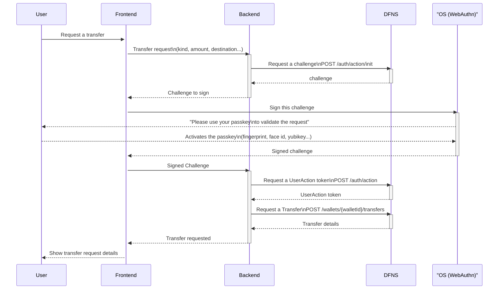
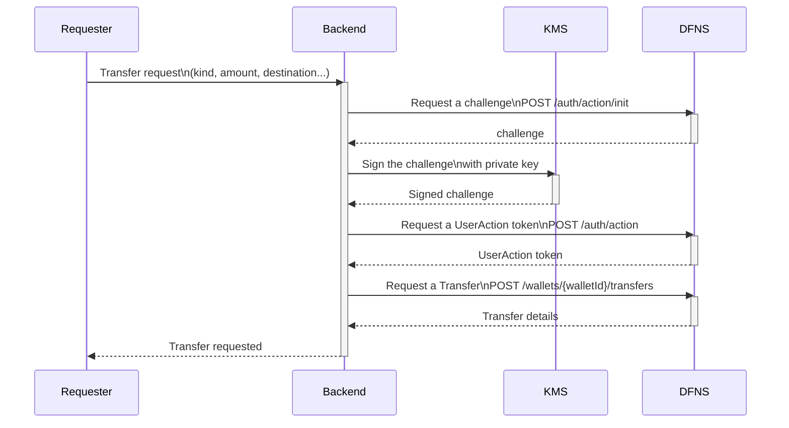

> ## Documentation Index
> Fetch the complete documentation index at: https://docs.dfns.co/llms.txt
> Use this file to discover all available pages before exploring further.

# User Action Signing

> All mutating DFNS API requests require User Action Signing: get a challenge, sign it, exchange it for a User Action Token, and include the token in your request.

User Action Signing is required for all state-changing API calls. It produces a cryptographically-signed audit trail, available via the [Audit Logs](/api-reference/auth/list-audit-logs) API.
A cryptographically-signed audit-trail is available using the [Audit Logs](/api-reference/auth/list-audit-logs) API for you to review who requested and validated every single action taken on DFNS.

<Tip>
  Check out the API Reference to get details about how to implement the different [signing flows](/api-reference/auth/signing-flows).
</Tip>

## Overall process

Signing is a four-steps process:

<Steps>
  <Step title="Get a challenge from the DFNS system.">
    A signing challenge is returned from a call to: [Get a User Action Challenge](/api-reference/auth/create-user-action-challenge)

    You will receive an object with the following properties (additional properties exist for signing with WebAuthn):

    | field | description |
    | - | - |
    | challenge | A string that will be signed with your private key |
    | challengeIdentifier | A JWT that identifies the signing session |
    | allowCredentials | The list of private key credentials that are enabled for the user |

    The `challengeIdentifier` expires 15 minutes after it is issued and can only be used once. If it expires before you submit the signature, request a new challenge.
  </Step>

  <Step title="Sign the challenge">
    This step differs depending on the type of credential you are using:

    * Human users often use passkeys, with which the signing process is all managed by their OS and browser in the frontend (website, mobile app, etc).
    * Machine users use asymmetric keys that you need to use in the backend with a crypto library.

    You will need to format the challenge into a [Client Data object](/api-reference/auth/credentials-data), convert the object into a JSON string and sign the string using one of the credentials listed in `allowCredentials`.

    See the example flow below.
  </Step>

  <Step title="Submit the User Action Signature to DFNS">
    Call the endpoint: [Create User Action Signature](/api-reference/auth/create-user-action-signature)

    Provide the base64url-encoded signed challenge, the base64url-encoded client data, and the credential ID used to sign.

    You receive a **User Action Token** in return. This token is single-use.
  </Step>

  <Step title="Include the User Action Token in your API call">
    Pass the User Action Token as the `X-DFNS-USERACTION` header on the actual request you needed to make.
  </Step>
</Steps>

## User signing flow using a Fido2 passkey

Example with a Fido2 passkey, where the use signs the challenge in your frontend:



See how to implement this [Fido2 signing flow](/api-reference/auth/signing-flows#fido2-signing-flow) in the API Reference.

You can test this flow with the [delegated wallets tutorial](/introduction/quickstart/7-non-custody-2-2-customer-login-and-delegated-wallets).

## Backend signing flow using an asymmetric key pair

Your backend can use a service account to call the DFNS API, but the service account will also be required to sign its sensitive requests.

When creating a service account, you will have to [generate a key pair](/guides/developers/generate-a-key-pair) and register its public key with DFNS.

The private key is used to sign the challenges.



See how to implement this [asymmetric keys signing flow](/api-reference/auth/signing-flows#asymmetric-keys-signing-flow) in the API Reference.

Example of what the backend needs to do to sign the challenge. In the flow above this is represented by the "KMS", a recommended secure storage for your credentials.

<Tip>
  When using any backend SDK with a configured signer, this signing process is handled automatically. The examples below show the manual implementation for reference, alongside the SDK-based approach.
</Tip>

<CodeGroup>
  ```typescript TypeScript (manual) theme={null}
  const signChallenge = async (challenge: UserActionSignatureChallenge) : Promise<SignedChallenge> => {

    // The data being signed includes information that is important for validating the request originated from a valid location.
    const clientData: Buffer = Buffer.from(
      JSON.stringify({
        type: 'key.get',
        challenge: challenge.challenge,
        origin: origin,
        crossOrigin: false,
      } as ClientData)
    )

    // Signing can be done locally or by calling an external signer (like AWS KMS).
    const signature = crypto.sign(
      undefined,
      clientData,
      apiKeyPrivateKey
    )

    // Pass back the signature, and the data that was signed so both can be parsed and validated properly.
    return {
      clientData: clientData.toString('base64url'),
      credId: challenge.allowCredentials.key[0].id,
      signature: signature.toString('base64url'),
    }
  }
  ```

  ```python Python (manual) theme={null}
  import json
  import base64
  from cryptography.hazmat.primitives import hashes, serialization
  from cryptography.hazmat.primitives.asymmetric import padding, ec

  def sign_challenge(challenge: dict, private_key_pem: str, origin: str) -> dict:
      # The data being signed includes information for validating the request origin
      client_data = json.dumps({
          "type": "key.get",
          "challenge": challenge["challenge"],
          "origin": origin,
          "crossOrigin": False,
      }, separators=(',', ':')).encode()

      # Load the private key
      private_key = serialization.load_pem_private_key(
          private_key_pem.encode(),
          password=None
      )

      # Sign with the appropriate algorithm based on key type
      if isinstance(private_key, ec.EllipticCurvePrivateKey):
          signature = private_key.sign(client_data, ec.ECDSA(hashes.SHA256()))
      else:
          signature = private_key.sign(client_data)

      # Return base64url-encoded values
      def to_base64url(data: bytes) -> str:
          return base64.urlsafe_b64encode(data).rstrip(b'=').decode()

      return {
          "clientData": to_base64url(client_data),
          "credId": challenge["allowCredentials"]["key"][0]["id"],
          "signature": to_base64url(signature),
      }
  ```

  ```python Python (SDK - automatic) theme={null}
  from dfns_sdk import DfnsClient, DfnsClientConfig, KeySigner

  # Configure the signer once - signing is then automatic
  signer = KeySigner(
      credential_id="cr-...",
      private_key=open("/path/to/private-key.pem").read(),
      app_origin="https://your-app.example.com"
  )

  config = DfnsClientConfig(auth_token="...", signer=signer)

  # Signing happens automatically for state-changing operations
  with DfnsClient(config) as client:
      wallet = client.wallets.create_wallet({"network": "EthereumSepolia"})
  ```

  ```go Go (SDK - automatic) theme={null}
  import (
      dfns "github.com/dfns/dfns-sdk-go/v2"
      "github.com/dfns/dfns-sdk-go/v2/signer"
      "github.com/dfns/dfns-sdk-go/v2/wallets"
  )

  // Configure the signer once - signing is then automatic
  keySigner, _ := signer.NewKeySigner("cr-...", string(privateKeyPEM))

  client, _ := dfns.NewClient(dfns.Options{
      AuthToken: "...",
      Signer:    keySigner,
  })

  // Signing happens automatically for state-changing operations
  wallet, _ := client.Wallets.CreateWallet(ctx, wallets.CreateWalletRequest{
      Network: "EthereumSepolia",
  })
  ```

  ```java Java (SDK - automatic) theme={null}
  import co.dfns.sdk.*;
  import co.dfns.sdk.auth.*;
  import co.dfns.sdk.wallets.model.*;

  // Configure the signer once - signing is then automatic
  Signer signer = KeySigner.fromEd25519PrivateKey("cr-...", privateKeyBytes);

  DfnsClientConfig config = DfnsClientConfig.builder()
      .authToken("...")
      .signer(signer)
      .build();

  // Signing happens automatically for state-changing operations
  try (DfnsClient client = new DfnsClient(config)) {
      Wallet wallet = client.wallets.createWallet(
          new CreateWalletRequest(Network.EthereumSepolia, null, null, null, null, null, null)
      );
  }
  ```
</CodeGroup>


This documentation is built and hosted on [Mintlify](https://mintlify.com), a developer documentation platform.