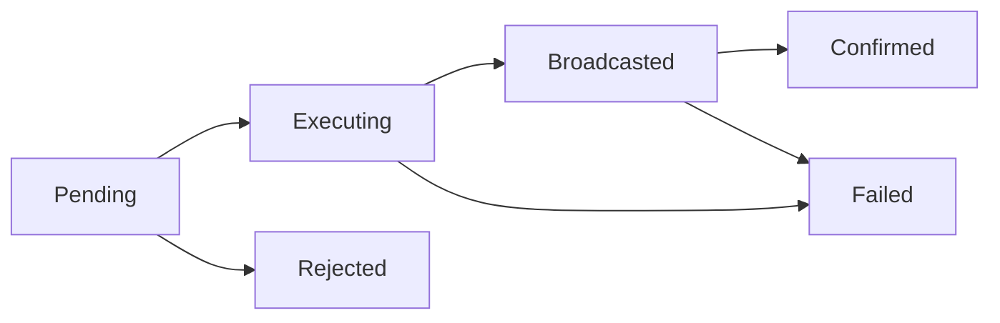

> ## Documentation Index
> Fetch the complete documentation index at: https://docs.dfns.co/llms.txt
> Use this file to discover all available pages before exploring further.

# Monitor transactions

> How to track DFNS transaction status using polling and webhooks, including event types, retries, and reconciling with on-chain confirmations.

This guide explains how to monitor transaction status after submitting transfers or broadcasts through DFNS.

## Listing endpoints: which one to use

DFNS provides three endpoints for viewing wallet activity. Each serves a different purpose:

| Endpoint | What it returns | Direction | Statuses | Filters |
| - | - | - | - | - |
| [Get Wallet History](/api-reference/wallets/get-wallet-history) | Confirmed on-chain events | Incoming and outgoing | Confirmed only | `direction`, `kind`, `contract` |
| [List Transfers](/api-reference/wallets/list-transfers) | Transfer API requests | Outgoing only | Pending, Executing, Broadcasted, Confirmed, Failed, Rejected | None |
| [List Transactions](/api-reference/wallets/list-transactions) | Broadcast API requests | Depends on transaction | Pending, Executing, Broadcasted, Confirmed, Failed, Rejected | None |

**In short:**

* Use **History** to show users their complete activity feed (incoming deposits + confirmed outgoing transfers)
* Use **Transfers** to track the status of outgoing transfers you initiated via the [Transfer API](/api-reference/wallets/transfer-asset)
* Use **Transactions** to track the status of custom transactions you submitted via the [Broadcast API](/api-reference/wallets/sign-and-broadcast-transaction)

<Note>
  Transfers and Transactions only appear in History once they reach `Confirmed` status. To show a complete view (including pending and failed), combine the relevant listing endpoints.
</Note>

## Transaction lifecycle

When you submit a transaction via the [Transfer API](/api-reference/wallets/transfer-asset) or [Broadcast API](/api-reference/broadcast), it goes through these states:



| Status | Description |
| - | - |
| `Pending` | Transaction created, awaiting policy approval |
| `Executing` | Approved; being signed and constructed for broadcast |
| `Broadcasted` | Signed and sent to the network mempool |
| `Confirmed` | Successfully included in a block |
| `Failed` | Signing/broadcast failed, or execution reverted on-chain |
| `Rejected` | Blocked by policy or approval rejected |

## Troubleshooting stuck transfers

What a transfer is waiting on depends on its status:

| Stuck in | What it means | What to do |
| - | - | - |
| `Pending` | Waiting for policy approval. | Check for a pending approval and have an approver act on it. The transfer will not progress until approvals complete or the request is rejected. |
| `Executing` | In the signing/construction pipeline (for example, awaiting a signer or a nonce ahead of it). | Use [Abort Transfer](/api-reference/wallets/abort-transfer) to cancel it and free any reserved inputs (such as Bitcoin UTXOs), then retry. |
| `Broadcasted` (not mined) | Sent to the mempool but not yet included in a block, typically due to a low fee. | On EVM networks, [Speed Up Transfer](/api-reference/wallets/speed-up-transfer) (rebroadcast with a higher fee) or [Cancel Transfer](/api-reference/wallets/cancel-transfer) (replace with a 0-value tx at the same nonce). |

If an incoming deposit is confirmed on-chain but not yet reflected in the wallet, that is balance indexing rather than a stuck transfer. See [Balance freshness](/guides/developers/displaying-balances#balance-freshness).

## Polling

Simple approach for occasional status checks. Query the transfer or transaction until it reaches a terminal state.

<CodeGroup>
  ```typescript TypeScript theme={null}
  async function waitForConfirmation(
    walletId: string,
    transferId: string,
    maxAttempts = 60,
    intervalMs = 5000
  ): Promise<Transfer> {
    for (let i = 0; i < maxAttempts; i++) {
      const transfer = await dfnsClient.wallets.getTransfer({
        walletId,
        transferId,
      })

      if (transfer.status === 'Confirmed') {
        return transfer
      }

      if (transfer.status === 'Failed' || transfer.status === 'Rejected') {
        throw new Error(`Transfer ${transfer.status}: ${transfer.reason}`)
      }

      await new Promise((resolve) => setTimeout(resolve, intervalMs))
    }

    throw new Error('Timeout waiting for confirmation')
  }

  // Usage
  const transfer = await dfnsClient.wallets.transferAsset({
    walletId,
    body: { kind: 'Native', to: recipient, amount: '1000000000000000000' },
  })

  const confirmed = await waitForConfirmation(walletId, transfer.id)
  console.log('Transaction hash:', confirmed.txHash)
  ```

  ```python Python theme={null}
  import time

  def wait_for_confirmation(
      client,
      wallet_id: str,
      transfer_id: str,
      max_attempts: int = 60,
      interval_seconds: float = 5.0
  ) -> dict:
      for _ in range(max_attempts):
          transfer = client.wallets.get_transfer(wallet_id, transfer_id)

          if transfer["status"] == "Confirmed":
              return transfer

          if transfer["status"] in ("Failed", "Rejected"):
              raise Exception(f"Transfer {transfer['status']}: {transfer.get('reason')}")

          time.sleep(interval_seconds)

      raise Exception("Timeout waiting for confirmation")

  # Usage
  with DfnsClient(config) as client:
      transfer = client.wallets.transfer_asset(
          wallet_id,
          body={"kind": "Native", "to": recipient, "amount": "1000000000000000000"},
      )

      confirmed = wait_for_confirmation(client, wallet_id, transfer["id"])
      print(f"Transaction hash: {confirmed['txHash']}")
  ```
</CodeGroup>

## Webhooks (recommended)

For production systems, use webhooks to receive status updates in real-time instead of polling.

### Relevant events

| Event | When it fires |
| - | - |
| `wallet.transfer.requested` | Transfer created |
| `wallet.transfer.broadcasted` | Transfer sent to mempool |
| `wallet.transfer.confirmed` | Transfer confirmed on-chain |
| `wallet.transfer.failed` | Transfer failed |
| `wallet.transfer.rejected` | Transfer rejected by policy |
| `wallet.transaction.requested` | Broadcast transaction created |
| `wallet.transaction.broadcasted` | Transaction sent to mempool |
| `wallet.transaction.confirmed` | Transaction confirmed on-chain |
| `wallet.transaction.failed` | Transaction failed |
| `wallet.transaction.rejected` | Transaction rejected by policy |
| `wallet.blockchainevent.detected` | Incoming deposit or other on-chain event |

See [Webhook Events](/api-reference/webhook-events) for the complete list and event data schemas.

### Basic handler

<CodeGroup>
  ```typescript TypeScript (Express) theme={null}
  app.post('/webhooks/dfns', express.json(), (req, res) => {
    // Always respond quickly with 200
    res.status(200).send('OK')

    const event = req.body

    switch (event.kind) {
      case 'wallet.transfer.confirmed':
        const { transferRequest } = event.data
        console.log(`Transfer ${transferRequest.id} confirmed`)
        console.log(`Tx hash: ${transferRequest.txHash}`)
        // Update your database, notify user, etc.
        break

      case 'wallet.transfer.failed':
        const { transferRequest: failed } = event.data
        console.error(`Transfer ${failed.id} failed`)
        // Alert, retry logic, etc.
        break

      case 'wallet.blockchainevent.detected':
        const { blockchainEvent } = event.data
        if (blockchainEvent.direction === 'In') {
          console.log(`Received ${blockchainEvent.value} deposit`)
        }
        break
    }
  })
  ```

  ```python Python (Flask) theme={null}
  from flask import Flask, request

  app = Flask(__name__)

  @app.route('/webhooks/dfns', methods=['POST'])
  def handle_webhook():
      # Always respond quickly with 200
      event = request.json

      if event["kind"] == "wallet.transfer.confirmed":
          transfer = event["data"]["transferRequest"]
          print(f"Transfer {transfer['id']} confirmed")
          print(f"Tx hash: {transfer['txHash']}")
          # Update your database, notify user, etc.

      elif event["kind"] == "wallet.transfer.failed":
          transfer = event["data"]["transferRequest"]
          print(f"Transfer {transfer['id']} failed")
          # Alert, retry logic, etc.

      elif event["kind"] == "wallet.blockchainevent.detected":
          blockchain_event = event["data"]["blockchainEvent"]
          if blockchain_event["direction"] == "In":
              print(f"Received {blockchain_event['value']} deposit")

      return "OK", 200
  ```
</CodeGroup>

<Warning>
  Always respond with `200` quickly, even if processing takes time. Use a queue for async processing. See [Webhooks best practices](/guides/developers/webhooks#webhooks-best-practices) for details.
</Warning>

### Setup

1. Create your webhook endpoint (see [Local development](/guides/developers/webhooks#local-development) for testing)
2. [Create a webhook](/api-reference/webhooks/create-webhook) via API or dashboard
3. Subscribe to the events you need
4. [Verify webhook signatures](/guides/developers/webhooks#verify-events-are-sent-from-dfns) to ensure events are from DFNS

## Detecting deposits

Use the `wallet.blockchainevent.detected` event to detect incoming transfers:

<CodeGroup>
  ```typescript TypeScript theme={null}
  case 'wallet.blockchainevent.detected':
    const { blockchainEvent } = event.data

    if (blockchainEvent.direction === 'In') {
      switch (blockchainEvent.kind) {
        case 'NativeTransfer':
          console.log(`Native deposit: ${blockchainEvent.value}`)
          break
        case 'Erc20Transfer':
          console.log(`ERC-20 deposit: ${blockchainEvent.value}`)
          console.log(`Token: ${blockchainEvent.contract}`)
          break
        // Handle other transfer types...
      }
    }
    break
  ```

  ```python Python theme={null}
  if event["kind"] == "wallet.blockchainevent.detected":
      blockchain_event = event["data"]["blockchainEvent"]

      if blockchain_event["direction"] == "In":
          kind = blockchain_event["kind"]

          if kind == "NativeTransfer":
              print(f"Native deposit: {blockchain_event['value']}")

          elif kind == "Erc20Transfer":
              print(f"ERC-20 deposit: {blockchain_event['value']}")
              print(f"Token: {blockchain_event['contract']}")

          # Handle other transfer types...
  ```
</CodeGroup>

<Note>
  Deposit detection (`wallet.blockchainevent.detected`) is only available for [Tier-1 networks](/networks#tier-1-blockchain-networks).
</Note>

## Matching deposits to your records

When processing incoming payments, you need to match blockchain transactions to records in your system (e.g., customer deposits, invoice payments). Since the sender initiates the transaction, you can't include your own tracking IDs in the transfer. Here are two strategies to solve this.

### Strategy 1: Unique wallet per deposit

Assign a unique wallet address to each pending deposit or customer. When you receive a `wallet.blockchainevent.detected` event, you know exactly which deposit it belongs to based on the receiving wallet.

**How it works:**

1. When a customer initiates a deposit, create or reserve a wallet for that specific transaction
2. Give the customer this wallet's address to send funds to
3. When the webhook fires for that wallet, match it to your pending deposit record
4. After confirmation (plus a safety buffer), release the wallet back to your pool

<CodeGroup>
  ```typescript TypeScript theme={null}
  // Simplified wallet pool pattern
  async function reserveDepositWallet(depositId: string): Promise<string> {
    // Get an available wallet from your pool, or create one
    const wallet = await getAvailableWallet() ?? await createNewWallet()

    // Mark it as reserved in your database
    await db.walletReservations.create({
      walletId: wallet.id,
      depositId: depositId,
      reservedAt: new Date()
    })

    return wallet.address
  }

  // In your webhook handler
  case 'wallet.blockchainevent.detected':
    const { walletId, blockchainEvent } = event.data

    if (blockchainEvent.direction === 'In') {
      // Find the deposit associated with this wallet
      const reservation = await db.walletReservations.findByWalletId(walletId)
      if (reservation) {
        await creditDeposit(reservation.depositId, blockchainEvent.value)
      }
    }
    break
  ```

  ```python Python theme={null}
  # Simplified wallet pool pattern
  async def reserve_deposit_wallet(deposit_id: str) -> str:
      # Get an available wallet from your pool, or create one
      wallet = await get_available_wallet() or await create_new_wallet()

      # Mark it as reserved in your database
      await db.wallet_reservations.create(
          wallet_id=wallet["id"],
          deposit_id=deposit_id,
          reserved_at=datetime.now()
      )

      return wallet["address"]

  # In your webhook handler
  if event["kind"] == "wallet.blockchainevent.detected":
      wallet_id = event["data"]["walletId"]
      blockchain_event = event["data"]["blockchainEvent"]

      if blockchain_event["direction"] == "In":
          # Find the deposit associated with this wallet
          reservation = await db.wallet_reservations.find_by_wallet_id(wallet_id)
          if reservation:
              await credit_deposit(reservation["deposit_id"], blockchain_event["value"])
  ```
</CodeGroup>

**Considerations:**

* Works on all networks
* Pre-create a pool of wallets to avoid creation latency during deposit flow
* Include a cooldown period before reusing wallets (to handle delayed transactions)
* Monitor pool size and create new wallets as needed

### Strategy 2: Memo fields (select networks)

Some networks support a memo (or equivalent) field that travels with the transaction. You can ask customers to include a reference code when sending funds, then match on that memo in the webhook.

**Supported networks:**

| Network | Field name | Notes |
| - | - | - |
| Stellar | `memo` | Commonly used by exchanges for deposit identification |
| Cosmos | `memo` | Standard field for transaction notes |
| TON | `memo` | Supported on native and Jetton transfers |
| Algorand | `memo` | Transaction notes field |
| Hedera | `memo` | Supported on all transfer types |
| XRP Ledger | `destinationTag` | Numeric tag (0-4294967295) |

<Warning>
  Memo-based matching requires customers to correctly include the reference. Always have a fallback process for deposits with missing or incorrect memos.
</Warning>

**When to use each strategy:**

| Strategy | Best for |
| - | - |
| Unique wallet per deposit | High reliability, any network, automated systems |
| Memo field | Networks that support it, when UX allows for customer input |

Many platforms use both: unique wallets as the primary method, with memo as an optional optimization on supported networks.

## Confirmation times

Different networks have different finality characteristics:

| Network | Average confirmation | Notes |
| - | - | - |
| Ethereum | \~12 seconds | True finality \~15 min |
| Polygon | \~2 seconds | Checkpoints to L1 |
| Arbitrum | \~0.5 seconds | Depends on L1 posting |
| Solana | \~0.4 seconds | Near-instant |
| Bitcoin | \~10 minutes | 6 blocks for high confidence |

<Note>
  DFNS marks transactions as `Confirmed` when included in a block. For high-value transactions on chains with probabilistic finality, you may want additional application-level confirmation tracking.
</Note>

## Handling failures

### Rejected by policy

<CodeGroup>
  ```typescript TypeScript theme={null}
  if (transfer.status === 'Rejected') {
    console.log('Rejected:', transfer.reason)
    // e.g., "Blocked by policy: TransactionAmountLimit exceeded"
  }
  ```

  ```python Python theme={null}
  if transfer["status"] == "Rejected":
      print(f"Rejected: {transfer['reason']}")
      # e.g., "Blocked by policy: TransactionAmountLimit exceeded"
  ```
</CodeGroup>

**Solutions:**

* Check your [policy configuration](/core-concepts/policies)
* Request approval if policy requires it
* Adjust transaction parameters

### Failed on-chain

<CodeGroup>
  ```typescript TypeScript theme={null}
  if (transfer.status === 'Failed') {
    console.log('Failed:', transfer.reason)
    // e.g., "execution reverted: insufficient balance"
  }
  ```

  ```python Python theme={null}
  if transfer["status"] == "Failed":
      print(f"Failed: {transfer['reason']}")
      # e.g., "execution reverted: insufficient balance"
  ```
</CodeGroup>

**Common causes:**

* Insufficient balance (including gas)
* Smart contract revert
* Nonce issues
* Gas limit too low

## Related

<CardGroup cols={2}>
  <Card title="Set up webhooks" icon="webhook" href="/guides/developers/webhooks">
    Best practices, verification, local development
  </Card>

  <Card title="Webhook events" icon="list" href="/api-reference/webhook-events">
    Complete event reference and data schemas
  </Card>

  <Card title="Transfer API" icon="paper-plane" href="/api-reference/wallets/transfer-asset">
    API reference for transfers
  </Card>

  <Card title="Idempotency" icon="rotate" href="/api-reference/idempotency">
    Preventing duplicate transactions
  </Card>
</CardGroup>


This documentation is built and hosted on [Mintlify](https://mintlify.com), a developer documentation platform.