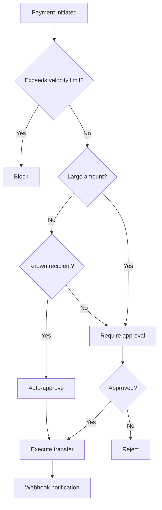

> ## Documentation Index
> Fetch the complete documentation index at: https://docs.dfns.co/llms.txt
> Use this file to discover all available pages before exploring further.

# Automate payments

> Set up policy-gated automated transfers using DFNS service accounts for payments, payroll, and disbursements across multiple networks.

export const SupportLink = ({children}) => {
  const url = "https://support.dfns.co";
  return <a href={url} target="_blank">{children || url}</a>;
};

Automate outbound payments by combining service accounts, policies, and webhooks. This solution covers service account setup, payment workflows, and high-volume considerations.

## What you'll need

* Understanding of [policies](/core-concepts/policies)
* Understanding of [service accounts](/guides/developers/service-account)
* Webhook endpoint for status notifications

## Components to configure

### Service account

A service account provides machine identity for automated operations. Grant minimal permissions for payment operations. See the [service account guide](/guides/developers/service-account) and [API reference](/api-reference/auth/service-accounts).

<Warning>
  Keep automation and approval authority separate by default. Service accounts can be [configured as policy approvers](/core-concepts/policies#service-account-approvers) if needed, but this requires explicit setup and staff activation.
</Warning>

### Payment policies

Configure policies that control when automated payments need human review:

* **Small payments** - May auto-approve with velocity limits for protection
* **Large payments** - Require human approval above threshold
* **Unknown recipients** - Require approval for addresses not in whitelist

See how to [create policies](/guides/create-policies) and [process approvals](/guides/approve-transactions).

### Webhooks

Configure webhooks to track payment status in real-time:

* `wallet.transfer.broadcasted` - Transaction sent to network
* `wallet.transfer.confirmed` - Transaction confirmed
* `wallet.transfer.failed` - Transaction failed
* `policy.approval.pending` - Approval needed

See how to [configure webhooks](/guides/developers/webhooks) and the [event reference](/api-reference/webhook-events).

### Transfer execution

Execute transfers via the API with your service account credentials. See how to [create transfers](/guides/developers/create-transfers) and [monitor status](/guides/developers/transaction-monitoring).

## Policy evaluation flow

When a payment is initiated, policies evaluate the transaction:

## Example configurations

### Standard payment workflow

| Policy | Configuration | Action |
| - | - | - |
| Velocity limit | \$100k/day | Block (safety cap) |
| Large payments | >\$10k | Require 1-of-2 approval |
| New recipients | Not in whitelist | Require approval |

### High-volume operations

For payment processors with high transaction volume:

| Policy | Configuration | Action |
| - | - | - |
| Very large payments | >\$500k | Require 2-of-3 approval |
| Hourly cap | \$2M/hour | Block |
| Frequency limit | >1000 tx/hour | Block |

## High-volume considerations

### Rate limits

DFNS API has rate limits to ensure fair usage. For high-volume operations:

* Check [rate limits documentation](/api-reference/rate-limits) for current values
* Implement queuing and backoff strategies
* Contact our <SupportLink>Support Team</SupportLink> if you need higher limits

### Multiple hot wallets

Distribute load across multiple wallets for:

* Higher throughput
* Balance management
* Risk distribution

### Reliability

Build reliability into your payment system:

* Use [idempotency keys](/api-reference/idempotency) to prevent duplicates
* Implement retry logic with exponential backoff
* Set up monitoring and alerting

## Related solutions

<CardGroup cols={2}>
  <Card title="Automate deposits" icon="money-bill-transfer" href="/solutions/automate-deposits">
    User deposits and transfers
  </Card>

  <Card title="Define treasury policies" icon="shield-check" href="/solutions/define-treasury-policies">
    Spending limits and controls
  </Card>

  <Card title="Apply compliance controls" icon="magnifying-glass" href="/solutions/apply-compliance-controls">
    Transaction screening
  </Card>
</CardGroup>

This documentation is built and hosted on [Mintlify](https://mintlify.com), a developer documentation platform.