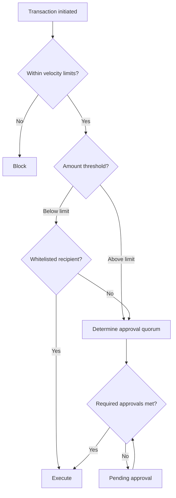

> ## Documentation Index
> Fetch the complete documentation index at: https://docs.dfns.co/llms.txt
> Use this file to discover all available pages before exploring further.

# Define treasury policies

> Configure multi-signature approvals, spending limits, and risk controls to protect your treasury operations with DFNS policies and address books.

Treasury policies protect your organization's digital assets by requiring approvals for sensitive operations and enforcing transaction limits. This solution covers the policy configurations needed for secure treasury management.

## What you'll need

* Understanding of [policies](/core-concepts/policies) and how they work
* Users configured with appropriate [permissions](/core-concepts/roles-and-permissions)
* Wallets tagged for policy targeting (e.g., `treasury`, `cold-storage`)

## Components to configure

### Multi-signature approvals

Require multiple approvers for high-value transactions. Configure approval quorums (e.g., 2-of-3, 3-of-5) that trigger based on transaction amount thresholds. See how to [create policies](/guides/create-policies) or [manage via API](/guides/developers/manage-policies).

### Spending limits

Control risk with transaction amount limits and velocity controls:

* **Single transaction limits** - Maximum amount per transaction
* **Daily/hourly caps** - Total value within a time window
* **Frequency limits** - Maximum transactions per time period

See how to [configure limits](/guides/create-policies) and the [policy API reference](/api-reference/policies).

### Recipient whitelisting

Restrict outbound transfers to known addresses. Transactions to non-whitelisted recipients can require approval or be blocked entirely. See how to [manage your address book](/guides/address-book) and [create whitelist policies](/guides/create-policies).

## Policy evaluation

Policies evaluate transactions through layered checks:

## Example configurations

### Conservative treasury

For organizations prioritizing security:

| Policy | Configuration | Action |
| - | - | - |
| All transactions | Always trigger | 2-of-3 approval |
| Large transactions (>\$100k) | Amount limit | 3-of-5 approval |
| Daily cap (\$500k) | Velocity limit | Block |

### Balanced operations

For organizations balancing security with efficiency:

| Policy | Configuration | Action |
| - | - | - |
| Transactions >\$10k | Amount limit | 1-of-2 approval |
| Transactions >\$100k | Amount limit | 2-of-3 approval |
| Non-whitelisted recipients | Recipient whitelist | 2-of-3 approval |
| Daily cap (\$1M) | Velocity limit | Block |

### Tiered by wallet type

Apply different limits based on wallet tags:

| Wallet Tag | Single Limit | Daily Cap | Approval |
| - | - | - | - |
| `hot-wallet` | \$10,000 | \$100,000 | 1-of-2 |
| `warm-wallet` | \$100,000 | \$1,000,000 | 2-of-3 |
| `treasury` | \$500,000 | \$5,000,000 | 3-of-5 |

## Foundation policies

Protect your security configuration itself:

* **Permission assignment protection** - Require approval when granting permissions
* **Permission modification protection** - Require approval when changing existing roles
* **Policy modification protection** - Require approval when changing policies

<Tip>
  Start with conservative limits and adjust based on operational experience. It's easier to relax controls than to recover from a security incident.
</Tip>

## Related solutions

<CardGroup cols={2}>
  <Card title="Govern wallet access" icon="folder-tree" href="/solutions/govern-wallet-access">
    Organize wallets with tags and permissions
  </Card>

  <Card title="Apply compliance controls" icon="shield-halved" href="/solutions/apply-compliance-controls">
    KYT integration and audit trails
  </Card>

  <Card title="Security best practices" icon="lock" href="/guides/security-best-practices">
    Permissions, policies, and security controls
  </Card>
</CardGroup>

This documentation is built and hosted on [Mintlify](https://mintlify.com), a developer documentation platform.