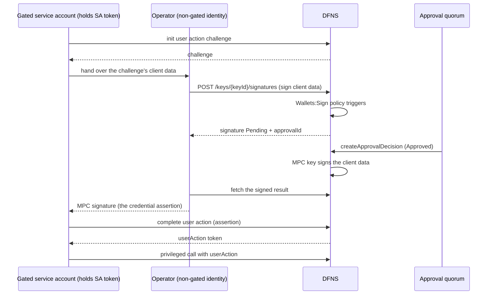

> ## Documentation Index
> Fetch the complete documentation index at: https://docs.dfns.co/llms.txt
> Use this file to discover all available pages before exploring further.

# Gate a service account with a policy

> Back a DFNS service account with an MPC key so every user action it signs is gated by the policy engine behind an approval quorum.

export const SupportLink = ({children}) => {
  const url = "https://support.dfns.co";
  return <a href={url} target="_blank">{children || url}</a>;
};

A service account authenticates its sensitive calls with User Action Signing: it signs a server-issued challenge with its credential private key. If that credential key is a DFNS MPC key, the signature is produced by `POST /keys/{keyId}/signatures`, an activity the policy engine evaluates. Put a `Wallets:Sign` policy on that key and the service account cannot complete a single user action until an approval quorum signs off. DFNS gates DFNS.

This turns an autonomous machine identity into a quorum-gated one without changing how the service account calls the API. The account still holds a bearer token; it simply cannot mint the user-action signature that privileged calls require until humans approve.

<Card title="Get the code" icon="github" href="https://github.com/dfns/dfns-solutions/tree/m/gated-service-account">
  dfns/dfns-solutions: gated-service-account
</Card>

## When to use this

* **High-privilege automation**: a service account that can create wallets, move treasury funds, or change permissions, where a stolen token must not be enough to act
* **Break-glass identities**: an account used rarely but powerfully, where every use should require named human sign-off
* **Regulated operations**: machine actions that need the same multi-party authorization as human ones, with a signed, auditable approval per action

## How it works



The service account's public key registered on the credential **is** the MPC key's public key. Every user action the account signs routes through the gated key, so the quorum authorizes each one individually.

Two identities appear by necessity, not by choice. Requesting the MPC signature is itself a user action, and the service account's only credential *is* the gated key, so it can never bootstrap its own signature request. Any non-gated identity with `Keys:Signatures:Create` can play the operator role: the walkthrough below uses the admin identity for brevity, and a production deployment typically uses a dedicated operator service account holding only that permission.

## What you'll need

* A [DFNS account](https://app.dfns.io) and an admin identity that can create keys, wallets, policies, permissions, and service accounts
* `serviceAccountsCanApprove` enabled on your organization if a service account sits in the approval group (contact our <SupportLink>Support Team</SupportLink>)
* Node.js v22.18+
* A dev or staging organization to try this on first

## Key facts this relies on

The design depends on four behaviors, each verified against the API:

* **Only signature generation is policy-gated on a key.** The policy engine evaluates `POST /keys/{keyId}/signatures` (activity kind `Wallets:Sign`). Key lifecycle operations (create, import, export, delegate, delete) are governed by permissions and are **not** policy-evaluated. This solution gates *use*, not the key's lifecycle.
* **Policies filter by wallet, not by key.** There is no `keyId` or `keyTags` filter, and keys carry no tags. A key-based signature request is matched to a policy through the wallets built on that key. To scope the policy, create one wallet from the key and tag it; the policy filters on `walletTags`. A key with no wallets can only be gated by an unfiltered (org-wide) policy.
* **Value-based rules cannot read a raw signature.** Rules like `TransactionAmountLimit` or `TransactionRecipientWhitelist` extract fields from a transaction payload. A user-action challenge is opaque bytes, so those rules fail closed and trigger. Use `AlwaysTrigger` for this pattern, since every signature then requires approval, which is exactly the intent.
* **An EdDSA/ed25519 key is the right choice.** Ed25519 signs the raw message with no pre-hashing, and its 32-byte public key converts directly to the SPKI PEM that `POST /auth/service-accounts` expects.

## Set up the gate

The admin identity creates everything except the service account. Creating a service account is session-only, because `POST /auth/service-accounts` rejects personal access tokens, so that one step is done in the dashboard.

### Step 1: Create the MPC key

```ts theme={null}
const key = await admin.post('/keys', { scheme: 'EdDSA', curve: 'ed25519', name: 'gated-sa-key' });
```

Keep `key.id` and `key.publicKey` (hex).

### Step 2: Create a tagged proxy wallet from the key

```ts theme={null}
await admin.post('/wallets', {
  network: 'SolanaDevnet',            // any network; the key is chain-agnostic
  name: 'policy-anchor',
  signingKey: { id: key.id },         // reuse the existing key (needs Keys:Reuse)
  tags: ['policy:gated-sa'],          // the policy scopes itself to this tag
});
```

This wallet exists only to carry the tag the policy filters on. Requires `Keys:Reuse` and `Wallets:Tags:Add`.

### Step 3: Create the quorum policy

```ts theme={null}
await admin.post('/v2/policies', {
  name: 'gated-sa-quorum',
  activityKind: 'Wallets:Sign',
  rule: { kind: 'AlwaysTrigger', configuration: {} },
  action: {
    kind: 'RequestApproval',
    autoRejectTimeout: 10,            // minutes; see the note on challenge lifetime below
    approvalGroups: [{
      quorum: 2,
      approvers: { userId: { in: ['us-approver-1', 'us-approver-2'] } },
      initiatorCanApprove: false,
    }],
  },
  filters: { walletTags: { hasAny: ['policy:gated-sa'] } },
});
```

<Warning>
  List approvers explicitly. An empty `approvers` object means "any human user" and does not admit service-account approvers. If a service account must approve, set `serviceAccountsCanApprove: true` on the group **and** list it in `approvers.userId.in`, because the engine requires both.
</Warning>

### Step 4: Create a minimal permission

Grant the service account only what it needs, for example `Wallets:Create` and `Wallets:Read`.

```ts theme={null}
const permission = await admin.post('/permissions', {
  name: 'gated-sa-perm',
  operations: ['Wallets:Create', 'Wallets:Read'],
});
```

### Step 5: Register the service account with the MPC key

Convert the key's 32-byte hex public key to SPKI PEM and register it in the dashboard (**Settings → Service Accounts → New**), assigning the permission from step 4.

```ts theme={null}
import { createPublicKey } from 'node:crypto';

const raw = Buffer.from(key.publicKey.replace(/^0x/, ''), 'hex');            // 32 bytes
const spki = Buffer.concat([Buffer.from('302a300506032b6570032100', 'hex'), raw]);
const pem = createPublicKey({ key: spki, format: 'der', type: 'spki' })
  .export({ type: 'spki', format: 'pem' });
```

Copy the access token the dashboard shows once. The service account is now backed by the gated key.

## The gated round-trip

Whenever the service account performs a privileged call, its user action is signed by the gated key.

<Steps>
  <Step title="Initiate the challenge (as the service account)">
    ```ts theme={null}
    const body = JSON.stringify({ network: 'SolanaDevnet', name: 'created-under-quorum' });
    const challenge = await sa.post('/auth/action/init', {
      userActionPayload: body,
      userActionHttpMethod: 'POST',
      userActionHttpPath: '/wallets',
    });
    ```
  </Step>

  <Step title="Request the MPC signature (this is the gated moment)">
    Build the client data and sign it with the key. The policy holds it for approval.

    ```ts theme={null}
    const clientData = JSON.stringify({ challenge: challenge.challenge, type: 'key.get' });

    const sig = await admin.post(`/keys/${key.id}/signatures`, {
      kind: 'Message',
      message: '0x' + Buffer.from(clientData).toString('hex'),
    });
    // sig.status === 'Pending', sig.approvalId is set
    ```
  </Step>

  <Step title="Approve (the quorum)">
    Each approver posts a signed decision. When the quorum is met, the signature executes.

    ```ts theme={null}
    await approver.post(`/v2/policy-approvals/${sig.approvalId}/decisions`, {
      value: 'Approved',
      reason: 'Verified the pending action',
    });
    ```
  </Step>

  <Step title="Complete the user action and make the call (as the service account)">
    Fetch the signed result, assemble the assertion, exchange it for a user-action token, and use it.

    ```ts theme={null}
    const signed = await admin.get(`/keys/${key.id}/signatures/${sig.id}`);
    const rawSig = Buffer.concat([hexBuf(signed.signature.r), hexBuf(signed.signature.s)]);

    const action = await sa.post('/auth/action', {
      challengeIdentifier: challenge.challengeIdentifier,
      firstFactor: {
        kind: 'Key',
        credentialAssertion: {
          credId: challenge.allowCredentials.key[0].id,
          clientData: b64url(clientData),
          signature: b64url(rawSig),
        },
      },
    });

    const wallet = await sa.post('/wallets', body, { 'x-dfns-useraction': action.userAction });
    ```
  </Step>
</Steps>

The service account created a wallet only because two approvers signed off on the signature that authorized it.

## Design considerations

### Challenge lifetime versus approval latency

The challenge from step 1 must still be valid when the assertion completes in step 4, so the quorum has to approve within the challenge's lifetime. That window is comfortable but bounded: a challenge completed successfully after a **five-minute** delay in testing, but do not assume hours. Keep `autoRejectTimeout` aligned with how fast your quorum realistically responds, and design the orchestrator to treat an expired challenge as a restart. A fresh challenge means a **new** signature and therefore a **new** approval. For quorums that may take longer than a few minutes, page approvers before initiating the challenge so the human delay happens up front, not inside the window.

### Approvers see opaque bytes

The pending approval shows a signature request over hex bytes. The client data contains only the challenge and a type; the real action payload is bound to the challenge server-side, so the approval screen does **not** render "create wallet X" or "transfer Y". Surface the pending `userActionPayload` to approvers out of band, or attach a decoded summary to the decision `reason`, so the quorum reviews the action rather than a hash.

### The signing identity is the residual surface

Whatever identity requests the signature holds `Keys:Signatures:Create`. That is acceptable only because every signature it can request on the gated key is quorum-gated, which is why scoping matters. If you add a second key, create it with its tagged wallet in the same step, or it is born ungated. Audit periodically that no untagged wallet exists on the gated key.

### Separate initiation from approval

Set `initiatorCanApprove: false` in production so the identity requesting the signature cannot also approve it. Keep the approver set distinct from the automation.

## Related

<CardGroup cols={2}>
  <Card title="Policies for signature requests" icon="signature" href="/guides/signing-policies">
    How the engine evaluates signing requests
  </Card>

  <Card title="Build programmable approval policies" icon="code" href="/solutions/build-programmable-approval-policies">
    Automate the approval side with a service account
  </Card>

  <Card title="Define treasury policies" icon="shield-check" href="/solutions/define-treasury-policies">
    Spending limits and approval quorums
  </Card>

  <Card title="Govern wallet access" icon="users" href="/solutions/govern-wallet-access">
    Permissions and access control
  </Card>
</CardGroup>


This documentation is built and hosted on [Mintlify](https://mintlify.com), a developer documentation platform.